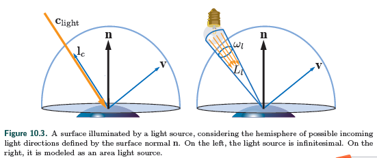
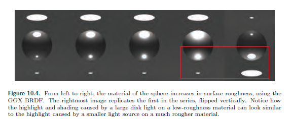
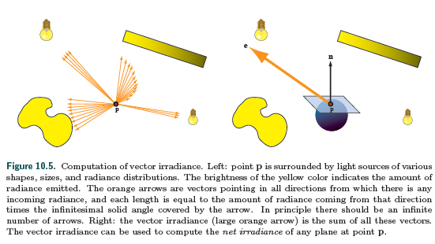
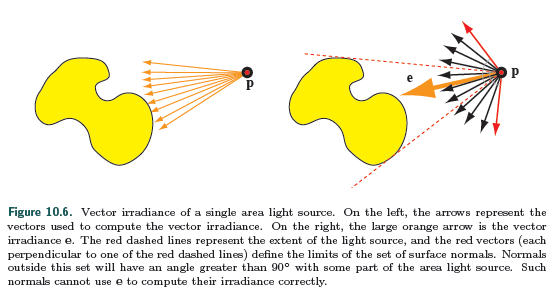

## 本章概述

​	第9章讨论了基于PBR的材质和在理想光源情况下如何模拟.通过这些内容,我们可以通过模拟灯光如何与曲面交互来执行着色计算,以测量在给定方向上有多少辐射发送到我们的虚拟相机.该光谱辐射是scene-referred 像素颜色,将被转换（第8.2节）为最终图像中给定像素的disply-referred颜色.

​	我们在第9.13.1节中已经看到,为了正确评估着色,我们必须解决整个像素足迹上表面BRDF响应的积分,即像素区域在表面上的投影.这种集成过程也可以被认为是一种抗锯齿解决方案.我们不是对一个不受频率分量约束的着色函数进行采样,而是预先进行积分.

​	到目前为止,只有点光源和定向光源的影响被提出,这限制了表面接收来自少数几个离散方向的光.这种光照的描述是不完整的.事实上表面接受来自所有方向的光.户外场景不止被sun着色,否则阴影下和不朝阳的表面都是黑色的.天空是一个重要的光源(来自太阳光在大气层的散射).天光的重要性可以通过看月球的照片来看出,月球由于没有大气层而缺少天光.

​	在阴天、黄昏或黎明,户外全靠天光照明.即使在晴朗的日子,从地球上看,太阳也会遮住一个圆锥体,因此它并非天生的小.奇怪的是,尽管太阳和月亮的尺寸相差巨大,但它们的角度却相似,大约有半度--太阳的半径比月亮大两个数量级.

​	...

​	介绍集中光源

​	区域光、点光、方向光

## 10.1 Area Light Sources

​	区域光

​	图10.3显示了面上一点的入射半球和极小光源与非零尺寸区域光源的差异.左侧是理想的光源9.4讨论过.从一个方向$\vec l_c$照亮表面.亮度通过颜色$c_{light}$表示,反射辐射来自朝着光源的白色Lambertian表面.点光源和方向光的在方向$\vec v$输出辐射贡献$L_o(\vec v)$为$\pi (\vec l_c,\vec v)c_{light}(\vec n\cdot\vec l_c)^+$.区域光的亮度通过它的辐射$L_l$得出,区域光与表面的立体角$\omega_l$.区域光在方向$\vec v$的输出辐射为$f(\vec l,\vec v)L_l(\vec n\cdot\vec l)^+$对$\omega_l$的积分.

​	极小光源的近似方程为:

​	$L_o(\vec v)=\int_{\vec l\in\omega_l}f(\vec l,\vec v)L_l(\vec n\cdot\vec l)^+d\vec l\approx \pi(\vec l_c,\vec v)c_{light}(\vec n\cdot\vec l_c)^+ \tag{10.1}$	

​	区域光的光照贡献是辐射($L_l​$)和从位置($\omega_l​$)看到的大小二者的函数.正如9.4节介绍的点,光源和方向光是模拟的且由于他们的零立体角导致的无穷大辐射所以现实中无法实现.了解近似法引入的视觉错误将有助于了解何时使用它,以及在无法使用它时采取什么方法.些误差将取决于两个因素:光源有多大,由它从阴影点覆盖的立体角测量,以及表面有多光滑.

​	

​	图10.4显示了镜面高光的大小和表面形状如何取决于材料粗糙度和光源的大小.对于一个小光源来说,相对于视场角而言,它隐藏了一个微小的立体角,误差很小.粗糙表面也往往表现出光源尺寸小于抛光表面的效果.一般来说,面向表面点的区域光发射和表面BRDF的镜面波瓣都是球面函数.如果我们考虑这两个函数作用显著的方向集,我们得到两个立体角.误差的决定因素与发射角的相关大小与BRDF镜面高光立体角的大小比较.

​	最后,注意区域光的高光可以通过一个点光源和提高面的roughness模拟.这项观测对于推导面积光积分的低成本近似值是有用的.它还解释了为什么在实践中,许多实时渲染系统只使用准时的来源产生合理的结果:艺术家补偿错误.但这么做是有害的,因为它将材质属性与特定的照明设置相耦合.以这种方式创建的内容在更改照明方案时看起来不正确.

​	对于朗伯曲面的特殊情况,将点光源用于区域光源可能是精确的.对于此类表面,向外辐射与辐照度成正比:

​	$L_o(\vec v)=\frac {\rho_{ss}}{\pi}E,	\tag{10.2}​$

​	其中$\rho_{ss}$味表面的albedo或者diffuse color.这种关系允许我们使用公式10.1的等效值来计算辐射度,也更简单:

​	$E=\int_{\vec l\in\omega_l}L_l(\vec n\cdot\vec l)^+d\vec l\approx \pi c_{light}(\vec n\cdot\vec l_c)^+,\tag{10.3}​$

​	矢量辐照度的概念有助于理解在有区域光源的情况下辐照度的行为.矢量辐照度是由Gershun[526][526]引入的,他称之为光矢量,并由Arvo[73][73]进一步扩展.利用矢量辐照度.可以将任意尺寸和形状的区域光源准确地转换成点光源或方向光源.

​	想象来自空间一点$\vec p$的辐射贡献$L_i$,见图10.5.我们可以假设$L_i$是波长无关的且因此可以看作标量.对于以入射方向$\vec l$为中心的每一个内斜角$d\vec l$,构造一个与$\vec l$对齐的向量,其长度等于从该方向入射的(标量)辐射乘以$d\vec l$.最后将所有这些矢量求和以产生矢量辐照度e​:

​	$e(\vec p)=\int_{\vec l\in\Theta}L_i(\vec p,\vec l)\vec ld\vec l, \tag{10.4}​$

​	

​	$\Theta$表示在整个方向球中进行积分.

​	矢量辐照度e可用于通过任何方向的平面在$\vec p​$处通过点积求净辐照度:

​	$E(\vec p,\vec n)-E(\vec p,-\vec n)=\vec n\cdot e(\vec p),\tag{10.5}​$

​	其中$\vec n$是平面的法向.通过平面的净辐照度是通过平面的“正边”（平面的法向$n$正向）所产生的辐照度与通过“负面”所产生的辐照度之差.就其本身而言,净辐照度对阴影没有用处.但,如果没有”负面“的辐射度(换句话说,被分析的光照分布$\vec l$和$\vec n$之间角度没有超过$90^\circ$),则$E(\vec p,-\vec n)=0$且

$E(\vec p,\vec n)=\vec n\cdot e(\vec p).\tag{10.6}$	

​	单区域光源的适量辐射度可以与公式10.6一起用,只要受光的Lambertian表面的$\vec n$和光源角度没有超过$90^\circ$的.见图10.6.

​	

​	如果我们的假设$L_i$是波长无关的站不住脚,那么我们不能定义一个单一的向量$\vec e$.然而,有色光在所有点上的相对光谱分布都是相同的,这意味着我们可以将$\vec L_i$分解成一个颜色$c'$和一个波长无关的辐射分布$L_{i}^{'}$.这种情况下我们可以通过给公式10.6的$\vec n\cdot e$乘以一个$c'$项来计算$L_i^{‘}$的e项.这样做会得到用于计算定向光源辐照度的相同方程式,替换如下:

​	$l_c=\frac {e(\vec p)}{||e(\vec p)||},\\c_{light}=c’\frac{||e(\vec p)||}{\pi}. \tag{10.7}$

​	我们有效地将任意形状和尺寸的区域光源转换为定向光源--不会引入任何误差.

​	公式10.4对于求矢量辐照度,可以用解析方法求解简单情况.比如,假设一个中心在$p_l$半径为$r_l$的球形光源.光线从球体上的每一点向各个方向发出恒定的辐射.对于这样一个光影,公式10.4和10.7产生如下公式:

​	$l_c=\frac {\vec p_l-\vec p}{||\vec p_l - \vec p||},\\c_{light}=\frac{r_l^{2}}{||\vec p_l-\vec p||^2}L_l. \tag{10.8}$

​	这个公式和5.2.2介绍的全光灯一样--$c_{light_0}=L_l,r_0=r_l,$且标准平方反比距离衰减函数(请注意,对于球形灯光,衰减采用通常的平方反比距离公式(距光表面的距离，而不是其中心)一般来说，并非所有区域灯光形状都是如此.盘状的衰减项为$1/(d^2+1)$.).这个衰减函数可以调整以考虑球体内的点,并将光源限制在给定的最大距离.更多细节见5.2.2.

​	只有在没有“负边”辐照度的情况下,所有这些才是正确的.另一种思考方法是,区域光源的任何部分都不能“在地平线下”或被表面遮挡.我们可以概括这一说法.对于朗伯体曲面,区域光源和点光源之间的所有差异都是由遮挡差异造成的.点光源的辐照度对光不被遮挡的所有法线都遵循余弦定律.Snyder推导了球面光源的分析表达式,考虑到遮挡[1671][1671].这个公式非常复杂.但由于它只依赖两个量($r/r_l$和$\theta_i$--$\vec n$和$\vec l_c$之间的角度),它可以预先计算成二维纹理.Snyder也给出了两个实时渲染易于控制的两个近似函数.

​	图10.4我们发现粗糙表面上区域光表现不明显.这项观察还允许我们使用一种less physically based 但仍然有效的方法来模拟区域光对Lambertian表面的影响:*wrap lighting*.在这项技术中,在$\vec n\cdot \vec l$阶段到0前对它进行了简单修改.Forsyth 给出的一个wrap lighting的形式[487][487]:

​	$E=\pi c_{light}(\frac {(\vec n\cdot\vec l)+k_{wrap}}{1+k_{wrap}})^+, \tag{10.9}$

​	 其中$k_{wrap}$从0(点光源)到1(覆盖整个半球的区域光源).另一个Value给出的模拟大面积区域光源的形式[1222][1222]:

​	$E=\pi c_{light}(\frac{(\vec n\cdot\vec l)+1}{2})^2. \tag{10.10}$

​	一般来说,如果我们计算区域照明,我们还应该修改阴影计算,以考虑到非准时源.如果我们不这样做,一些视觉效果会被刺眼的阴影所抵消[193][193].如第7章所述,软阴影可能是区域光源最明显的效果.

### 10.1.1 Glossy Materials

​	区域光在non-Lambertian表面的效果需要更复杂些.Snyder推到了一个球形光源的解决方案[1671][1671],它仅限于原始的反射矢量声子材料模型,且极其复杂.在实际应用中需要使用近似值.

​	区域光在光滑表面的主要效果是高光(highlight).见图10.4.它大小和形状与区域光类似,根据表面的粗糙度对边缘进行模糊.这一观察结果导致了对这种效应的几种经验近似.在实践中这些很有说服力.比如我们可以修改高光计算结果,

​	

382

## 引用

[73]: Arvo, James, "The Irradiance Jacobian for Partially Occluded Polyhedral Sources," in SIGGRAPH '94: Proceedings of the 21st Annual Conference on Computer Graphics and Interactive Techniques, ACM, pp. 343{350, July 1994. Cited on p. 379

[193]: Bredow, Rob, "Fur in Stuart Little," SIGGRAPH Advanced RenderMan 2: To RI INFINITY
and Beyond course, July 2000. Cited on p. 382, 633

[487]: Forsyth, Tom, "The Trilight: A Simple General-Purpose Lighting Model for Games," TomF's
Tech Blog, Mar. 22, 2007. Cited on p. 382, 432

[526]: Gershun, Arun, "The Light Field," Moscow, 1936, translated by P. Moon and G. Timoshenko,
Journal of Mathematics and Physics, vol. 18, no. 2, pp. 51{151, 1939. Cited on p. 379

[1222]: Mitchell, Jason, Gary McTaggart, and Chris Green, "Shading in Valve's Source Engine,"
SIGGRAPH Advanced Real-Time Rendering in 3D Graphics and Games course, Aug. 2006.
Cited on p. 289, 382, 402, 499

[1671]: Snyder, John, \Area Light Sources for Real-Time Graphics," Technical Report MSR-TR-96-
11, Microsoft Research, Mar. 1996. Cited on p. 382