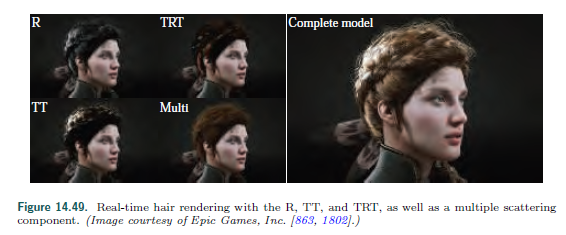
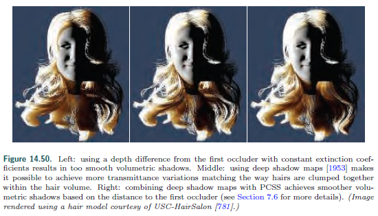

642

## 14.7 Hair and Fur

### 14.7.1 Hair

​	这里只是简述,详细细节和实现通过引文获得.

​	Kajiya 和 Kay [847][847]发展的BRDF模型用来渲染由有组织的和无限小的圆柱体纤维组成的体积.这个模型在9.10.3讨论,最早用来基于表面密度通过体纹理进行光线追踪渲染皮革.这个BRDF用于表示随体积变化的镜面反射和漫反射光响应,也可用于头发.

​	Marschner等人的开创性工作[1128][1128]测量了人类毛发中的光散射,并基于这些观察提出了一个模型.在单根发束中观察到不同的散射成分.这些都在图14.47中描述.首先,一个R分量代表了在表皮上的空气/纤维界面上的光反射,这导致了一个向根部移动的白色反射峰.第二,TT分量表示通过一次从空气传播到头发材料和二次从头发传播到空气.最后第三个TRT组件表示光在毛发纤维中通过被传输、由纤维的另一侧反射,然后在毛发材料外被传回.变量名中的“R”表示一个内部反射.TRT组件被视为二次反射高光,与R相比发生了偏移,并且由于光线在通过纤维材料时被吸收而被着色。

​	视觉上R分量被认为是头发无色的镜面反射.TT分量被认为是当一卷头发从后面被照亮是的一个明亮的亮点.TRT组件对于渲染真实头发至关重要,因为它会在带有偏心的头发上产生闪光,即在现实生活中,头发的横截面不是一个完美的圆形,而是一个椭圆形.闪光对于可信度很重要,因为这些闪光会使头发看起来不均匀.见图14.48.	

​	Marschner等人[1128][1128]提出将R、TT和TRT组件建模为头发BSDF的一部分的函数,它表示头发ber对光的响应.该模型适当地考虑了透射和反射事件中的菲涅耳效应,但忽略了其他更复杂的光路,如TRRT、TRRRT和更多.

​	但是,这个模型原型不是能量守恒的.这在d'Eon等的工作下修复了.BSDF通过考虑roughness和镜面椎体的缩放实现了能量守恒.这些分量也被扩展包括更长的路径(比如TR*T).透过率也可以通过测量黑色素消光系数来控制.与Marschner等的工作类似,他们的模型[1128][1128]出了在带偏心率的头发丝上呈现闪光.Chiang等提出另一个模式[262][262],他们的模型roughness和多重散射(scattering)颜色的参数化方法.比起调整高斯方差或黑色素浓度系数,这对艺术家更直观.

​	例如，艺术家可能希望通过更改粗糙度（roughness)参数,为角色头发的镜面反射项编辑一个特定的外观.有了一个基于物理的能量守恒(energy-conserving and energy-preserving)模型,头发体积深处的散射光也会发生变化.为了提供更艺术的控制,可以分离前几个散射路径（R、TT、TRT）和多个散射部分[1525][1525].这是通过维护第二组BSDF参数实现的,这些参数仅用于多个散射路径.作为补充,BSDF的R,TT,TRT分量可以由一些可以被艺术家理解且用来进一步还原外观的简单的数学形状.根据输入和输出方向对BSDF进行归一化处理,使整个系统仍然守恒.

​	

​	上述的每个BSDF模型都是复杂的、耗算力的,大多用于电影产品的光线追踪环境.谢天谢地,实时的版本也是存在的.Scheuermann提出了一个特别的BSDF模型,该模型易于实现、快速渲染,并且在将头发渲染为大的四元色带(large quad ribbons)时看起来很有说服力[1560][1560].更长远来说,在实时渲染中使用Marschner model[1128][1128]通过LUT搜索(用输入、输出方向作为索引参数)BSDF是可能的[1274][1274].但是这种方法很难渲染具有空间变化外观的头发.为了避免这个问题,最近一个基于物理的实时模型[863][863]使用简化的数学来近似以前工作中的组件,以获得令人信服的结果.见14.49.然而,与离线结果相比,所有这些实时头发渲染模型在质量上存在差距.简单的算法通常不具有先进的体积阴影(volumetric shadows)或多重散射.这种效果对低吸收的头发尤其重要,例如金发.

​	在体积阴影的情况下,最新的解决方案[36,863][36,863]依赖于一个透射率值,该值是根据恒定吸收$\alpha_a​$沿光线方向从遇到的第一根头发到当前光纤的距离$d​$.这种方法既实用又简单,因为它依赖于任何引擎中常见的阴影图.然而,它不能代表由发束引起的局部密度变化,这对明亮的头发尤为重要.见14.50.为了解决这个问题,可以使用体积阴影表示法.见7.8节.

​	在渲染头发时多重散射是一个费算力的部分.这没有很多适合实时渲染的解决方案.Karis[863][863]提出一个模拟多重散射的方法.这个特别的模型使用了假法线(类似于弯曲的法线)、包裹的漫射光和头发的基础颜色,在与光相乘之前将其提升为深度相关的功率,在光线分散到多条线之后近似于颜色饱和度.

​	Zinke等发表了一个更高级的二重散射技术(dual-scattering).它是双重的,因为它根据两个因素来评估散射光的数量.首先，通过结合阴影像素和光线位置之间遇到的每条发束的BSDF来评估全局透射率因子$\Psi^G$.因此，$\Psi^G$给出了适用于阴影位置入射辐射的透射率.该值可在GPU上通过计算头发数和计算光路上的平均股方向(后者在使用BSDF时)以及透射率来求值.使用深不透明度映射[1953][1953]或占用映射[1646][1646]可以累积这些数据.第二,一个局部散射分量$\Psi^L$近似于在阴影位置传输的辐射将分散在当前位置周围的头发中,并有助于辐射.这两项都是像$\Psi^G+\Psi^G\Psi^L$这样相加,通过像素链BSDF累积光源贡献.这项技术更昂贵,但它是一个精确的实时近似光多次散射现象在头发体积.它还可以与本章介绍的任何BSDF一起使用.

​	环境照明是另一个复杂的输入,用于评估动画半透明材质.简单地从球谐波来采样辐照度是很常见的.也可以通过从头发静止位置计算的非定向预集成环境光遮挡来加权照明[1560][1560].卡里斯提出了一种环境照明的特设模型[863][863]--使用相同的假normal用来多重散射.

​	更多信息,可从网上获取来自Yuksel和Tariq的关于全面的实时头发渲染课程[1954][1954]。在阅读研究论文和学习更多之前本课程将教你所有关于头发渲染的许多领域,如模拟、碰撞、几何、BSDF、多重散射和体积阴影.头发在实时应用中看起来很有说服力.然而,为了更好地近似基于物理的环境光和头发中的多次散射,仍然需要进行大量的研究.

​	

## 引文

[36]: AMD, GPUOpen, "TressFX," GitHub repository, 2017. Cited on p. 642, 644, 647

[262]: Chiang, Matt Jen-Yuan, Benedikt Bitterli, Chuck Tappan, and Brent Burley, "A Practical and
Controllable Hair and Fur Model for Production Path Tracing," Computer Graphics Forum
(Eurographics 2016), vol. 35, no. 2, pp. 275{283, 2016. Cited on p. 643

[847]: Kajiya, James T., and Timothy L. Kay, "Rendering Fur with Three Dimensional Textures,"
Computer Graphics (SIGGRAPH '89 Proceedings), vol. 17, no. 3, pp. 271{280, July 1989. Cited on p. 359, 642

[863]: Karis, Brian, "Physically Based Hair Shading in Unreal," SIGGRAPH Physically Based Shading in Theory and Practice course, July 2016. Cited on p. 641, 644, 646

[1128]: Marschner, Stephen R., Henrik Wann Jensen, Mike Cammarano, Steve Worley, and Pat Hanrahan,"Light Scattering from Human Hair Fibers," ACM Transactions on Graphics (SIGGRAPH 2003), vol. 22, no. 3, pp. 780{791, 2000. Cited on p. 359, 640, 641, 642, 643, 644

[1525]: Sadeghi, Iman, Heather Pritchett, Henrik Wann Jensen, and Rasmus Tamstorf, "An Artist
Friendly Hair Shading System," in ACM SIGGRAPH 2010 Papers, ACM, article no. 56, July Cited on p. 359, 644

[1560]: Scheuermann, Thorsten, "Practical Real-Time Hair Rendering and Shading," in ACM SIGGRAPH 2004 Sketches, ACM, p. 147, Aug. 2004. Cited on p. 641, 644, 645

[1646]: Sintorn, Erik, and Ulf Assarsson, "Hair Self Shadowing and Transparency Depth Ordering
Using Occupancy Maps," in Proceedings of the 2009 Symposium on Interactive 3D Graphics
and Games, ACM, pp. 67{74, Feb.{Mar. 2009. Cited on p. 645

[1953]: Yuksel, Cem, and John Keyser, "Deep Opacity Maps," Computer Graphics Forum, vol. 27,
no. 2, pp. 675{680, 2008. Cited on p. 257, 645, 646

[1954]： Yuksel, Cem, and Sara Tariq, SIGGRAPH Advanced Techniques in Real-Time Hair Rendering and Simulation course, July 2010. Cited on p. 45, 642, 646, 649

## 收集的资料

[2012.实时头发]: https://pdfs.semanticscholar.org/315c/2fdf345f0382280488001cdaccfe557c7d2d.pdf?_ga=2.135427634.2051510291.1548727113-939637951.1548727113

http://m.sohu.com/a/156416946_726639

爱丽丝梦游仙境 发丝：https://www.cnblogs.com/miloyip/archive/2011/06/14/alice_madness_returns_hair.html

- [1] Thomas Jakobsen, “[Advanced Character Physics](http://www.gamasutra.com/gdcarchive/2001/jakobsent.doc)”, Game Developer Conference, 2001.
- [2] Hubert Nguyen, William Donnelly “[Hair Animation and Rendering in the Nalu Demo](http://www.cnblogs.com/http.developer.nvidia.com/GPUGems2/gpugems2_chapter23.html)”, GPU Gems 2, Addison-Wesley, 2005.
- [3] Thorsten Scheuermann, “[Hair Rendering and Shading](http://developer.amd.com/media/gpu_assets/Scheuermann_HairRendering.pdf)”, Game Developer Conference, 2004.