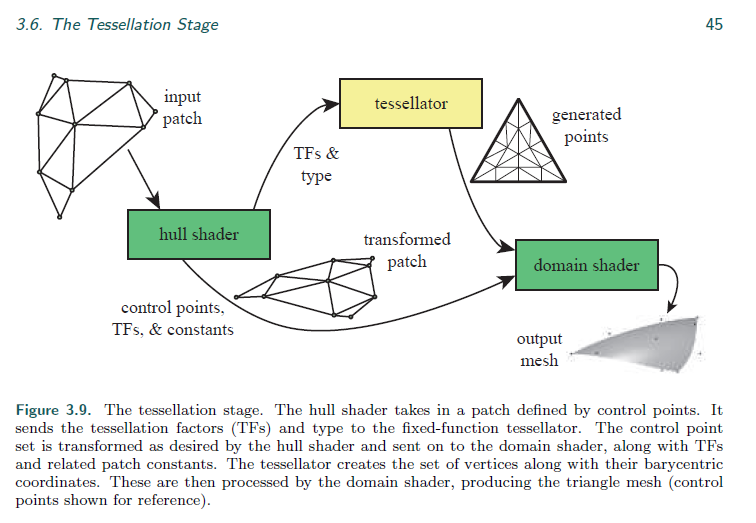

## pipeline综述

核心

application->Geometry Processing->Raterization->Pixel Processing

### application

场景管理(aoi,oct,)

区域裁剪，资源动态加载

摄像机范围裁剪，遮挡提出

配合使用：compute shader

commit render cmd

### Geometry Processing

内容：透视，视锥裁剪，顶点着色，顶点变换，图元组装

拆分

Vertex Shading->Projection->Clippiong->Screen Mapping

view space，摄像机朝向-z，可以简化操作，加快裁剪

### 额外的

tesselation,gometry shading,stream output

clipping

https://www.cnblogs.com/polobymulberry/p/5126892.html

Tess阶段：

>  DX:hull shader,tessellator,domain shader
>
> OGL:hull合并在tessellation control shader,domain shader->tessellation evaluation shader

tessellator 在ogl中成为:primitive generator

hull shader是特俗的patch primitive

几何着色器

​	可以输出流数据

### screen mapping

片元任为3D坐标

转为屏幕坐标

其中z(ogl[-1,1];dx[0,1])

### rasterization

分两个阶段:Triangle setup->Triangle Traversal

可见性测试:

裁剪，模板，深度，alpha

### pixel processing

阶段:pixel shading->merging

双缓冲

color-buffer

z-buffer

stencil-buffer

Operation:raster operations(ROP),blend operations

## 坐标系

clip

view volume(unit cube)

(-1,-1,-1)->(1,1,1)

screen 

其中z(ogl[-1,1];dx[0,1])

浮点数与像素坐标的关系

ogl:0.0

dx:0.5

屏幕坐标系

ogl:左下角

dx:左上角

## 导读

A Trip Down the Graphics Pipeline 固定管线，便于理解pipeline理论和核心算法

## 总结

> cpu

> GPU
>
> > 1.几何极端
> >
> > vertex shader
> >
> > (hull stage)
> >
> > (tess stage) tess shader
> >
> > (domain stage)
> >
> > Geometry Shader
> >
> > 图元组装
> >
> > 2 光栅化Rasterizer
> >
> > (face culling)
> >
> > (depth bias adjustment)
> >
> > (depth clip)
> > (scissor)
> > (clipping)
> >
> > (homogenous division)
> >
> > (viewport transformation)
> > (multisampling/line anti-aliasing)
> >
> > 3.图元操作
> >
> > pixel shader
> >
> > (pixel color and depth)
> >
> > merge stage
> >
> > > stencil test(before pixel shader)
> > >
> > > depth test 
> > >
> > > blending

vs>tess>gs>clipping>screen mapping>triangle setup&traversal>ps,merger