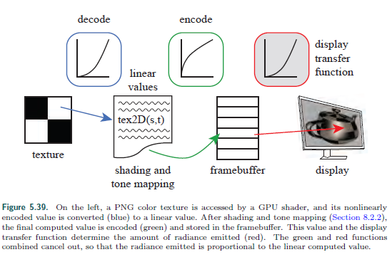

##  Shading Models

## Light Scources

##  Aliasing 

## Display Encoding

运类似lighting,texturing计算操作时的颜色值一般使用linear，

但是颜色图可能存储为sRGB

> CRT历史原因，该种设备输出信号和输入信号有这个关系:y = pow(x,1/2.2)
>
> 现代显示器也通过电路模仿这种关系
>
>

texture---decode-->tex2D(s,t) : linear --encode-->fb:sRGB --display transfer function(decode)--->display

$Color_{sRGB}\in[0,255]$ 整数

$Color_{linear}\in[0,1]$浮点数

*linear-to-sRGB*

$y=f_{sRGB}^{-1}(x)$=$\left\{\begin{array}{c}1.055x^\frac{1}{2.4}-0.55,x>0.0031308 \\12.92x,x<=0.0031308 
\end{array} \right.$

简化算法(gamma correction)

$y=f_{display}^{-1}(x)=x^{\frac{1}{\lambda}}$

$\lambda=2.2​$

$\left\{\begin{array}{c}1.055x^\frac{1}{2.4}-0.55 \\\frac{y}{12.92},y<=0.04045 
\end{array} \right.​$

*sRGB-to-linear*

$x=f_{sRGB}(y)$=$\left\{\begin{array}{c}{(\frac{y+0.055}{1.055})}^{2.4} ,y>0.04045\\\frac{y}{12.92},y<=0.04045 
\end{array} \right.​$

简化

$x=f_{display}(y)=y^\lambda$

移动端的方法

$y=f_{simpl}^{-1}(x)=\sqrt(x),$

$x=f_{simpl}(y)=y^2,$

### 

