## 8.0 说明

​	这章很重要，系统的讲解了colorspace相关知识,随后介绍了tone-mapping、Explosure.

​	color space是从光波波长和辐射的曲线一步一步过渡到RGB颜色空间的.其中重要的中间颜色空间为 XYZ颜色空间,经过它可以实现所有RGB颜色空间的转换.随后又对RGB颜色空间进行介绍,重要的RGB颜色空间为(颜色空间所表示的范围逐一递增):sRGB,DCI-P3,ACEScg.

​	在了解关于tone-mapping的曲线时可以参考提供的引文,其中尤其关注目前被广泛使用的"filmic tone-mapping".这个曲线在unity和UE4中都能找到对应源码.他们都是基于ACES开源项目([ampas/aces-dev][https://github.com/ampas/aces-dev],以后会基于这个项目详细解析color space)完成的.都是在ACEScg颜色空间进行的计算.其中unity的参数被写死了没有暴露出来,UE4暴露了若干参数,经过简单理解就能将UE4的实现移植到unity中,效果良好.

## 8.1 LigthQuantities

人眼可见光波长范围:[400,700]nm

### 单位换算

| Name              | Symbol Units | Units                  |
| ----------------- | ------------ | ---------------------- |
| radiant           | φ            | watt(W)                |
| irradiance        | E            | $\frac{W}{m^2}$        |
| radiant intensity | I            | $\frac{W}{sr}$         |
| radiance          | L            | $\frac{W}{(m^2*(sr))}$ |

> * radiant flux: 辐射通量$\Phi​$,
> * Irradiance:辐射度$E$.每平米的辐射.$E = \frac{d\Phi}{dA}$,单位$\frac{w}{m^2}$
> * radiant intensity:辐射强度$I$.描述每个立体弧度的watts强度,$I=\frac{d\Phi}{d\omega}$
> * radiance:辐射,$L$.一条光线的电磁辐射度量.$L=\frac{d^2\Phi}{dAd\omega}$.这个是垂直于射线的区域的测量值.如果应用于其他表面,就必须使用余弦校正,在"projected area"使用的就是校正值.该值是摄像机、眼睛的感知值,对rendering来说非常重要,shading方程的目的就是计算表面上点到摄像机的光线的radiance.$L$的值就是第5章介绍的$c_{shaded}$中的Physicall based equivalent.辐射度的公制单位是瓦特每平方米每弧度角.

> * solid angle:在三维空间，一个solid angle是从球心到球面的圆锥,范围为:$[0,4\pi]​$,二位表面为$[0,2\pi]​$

​	环境中的辐射可以看作是五个变量（或六个变量，包括波长）的函数，称为辐射分布.其中三个分别为:location，两个direction.

​	在shading方程里,radiance常为$L_0(x,\vec d)$或$L_i(x,\vec d)$--辐射来自点$x$或者摄入它.方向向量$\vec d$为ray的方向--指向$x$,但在$L_i$函数里$\vec d$为光线方向的反方向---为了方便计算、点乘.

​	当忽略空气影响(比如fog)radiance将不受距离衰减.也就是一个面上任何一点到view的辐射是一样的.大多数光波是复合光.这被抽象为SPDs(spectral power distributions)--光在不同波长上的能量分布.

​	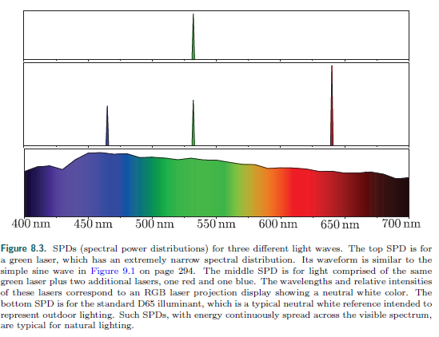

​	所有辐射量都有光谱分布,因为这些分配是波长上的密度，它们的单位是原始数量除以纳米。例如，辐照度的光谱分布以瓦特为单位。每平方米每纳米由于使用完整的SPD进行渲染非常困难，特别是在交互速率下，在实践中，辐射量用三重RGB表示..

​	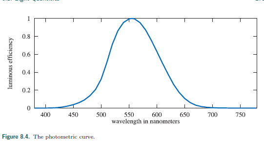

### 8.1.2 Photometry

​	光速测定法
​	Luminance 描述亮度.HDR电视亮度范围为[500,1000] nits.天空为8000nits,60-watt 灯泡为12000nits,太阳为600000nits.

| Radiometric Quantity: Units | Photometric Quantity: Units      |
| --------------------------- | -------------------------------- |
| radiant flux:watt(W)        | luminous flux:lumen              |
| irradiance:W/m2             | illuminance: lux (lx)            |
| radiant intensity: W/sr     | luminous intensity: candela (cd) |
| radiance: W/(m2sr)          | luminance: cd/m2 = nit           |

### 8.1.3 Colorimetry

​	比色法

​	CIE(commission International d'Eclairage),color-matching ,color-matching functions---将spectral power distribution(光谱功率分布)转换为三原色.

​	645 nm for r, 526 nm for g, and 444 nm for b

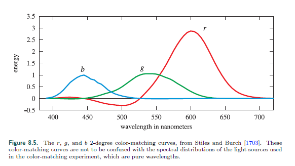

​	 可见色范围内,给出一个光强,，通过上图独处RGB三原色.但是这三个r,g,b光不能直接表示所有的可见色因为其中有负值.CIE通过color-matching functions得到三个正的假设光源.三条曲线是原始r,g,b颜色linear混合的color-matching functions.

​	这类color-matching function的贡献项为$\overline {x}(\lambda)$、$\overline {y}(\lambda)$、$\overline {z}(\lambda)$,如图8.6.color-matching function ​$\overline {y}(\lambda)$和图8.4一样--因为这条曲线的辐射已经转换为亮度(luminance).

​	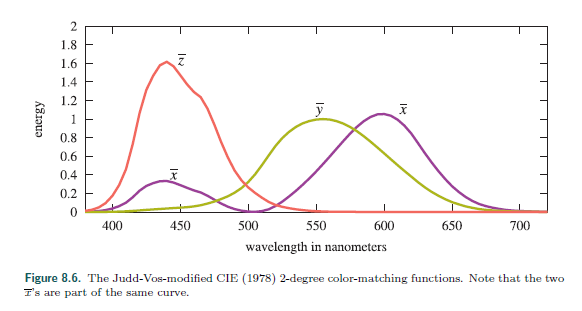

​	和前面的颜色匹配函数一样,$\overline {x}(\lambda)$、$\overline {y}(\lambda)$、$\overline {z}(\lambda)$  用乘法和积分将任意  $SPD s(\lambda)​$转换为三个值:

​	$X=\int_{380}^{780}s(\lambda)\overline {x}(\lambda)d\lambda,$ $Y=\int_{380}^{780}s(\lambda)\overline {y}(\lambda)d\lambda,$$Z=\int_{380}^{780}s(\lambda)\overline {z}(\lambda)d\lambda.$

​	$X,Y,Z$是CIE XYZ颜色空间的值,它通常用来转换为luminance(brightness)和色度.色度是与亮度无关的东西,相同色度可能具有不同亮度.为了这个目的,CIE定义了一个二位的色度颜色空间--将颜色投影到$X+Y+Z=1$平面上,这个颜色空间的坐标称为$x,y,z$:

​	$x=\frac{X}{X+Y+Z},Y=\frac{Y}{X+Y+Z},z=\frac{Z}{X+Y+Z}=1-x-y.​$

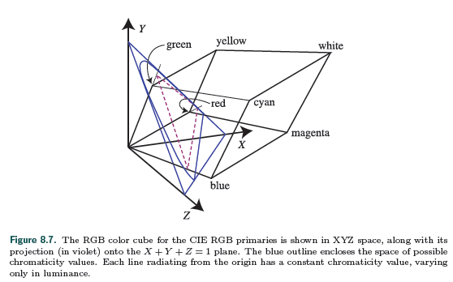

​	从原点辐射出来的每条射线都有同样的色度值，他们的亮度不同.所以这里可以映射到一个平面(这里选择的是$X+Y+Z=1$).

z通常省略,x,y色度坐标在*CIE 1930 chromaticity diagram*被推广.如图8.8，曲线的轮廓显示了可见光谱的范围,曲线的底部的直线称为紫线(purple line).黑点光源D65的色调--白点，用来定义白色或无色.

​	

​	已知颜色$P_1(x,y)$(色调),从$P_0$白点到该点绘制一条射线与包围曲线交与$P_2$,$P_0$到$P_1$的距离与$P_1$到$P_2​$的距离的关系是颜色的纯度,也就是越靠近边缘的颜色三原色越单一.但这种术语在图形渲染中很少用,常用的是饱和度(saturation)和色调(hue)--分别于纯度和光波长相关.在[[1706]][1706]讨论了饱和度和色调.

​	色度描述了一个平面,第三维维$Y$--亮度.这被称为$xyY$坐标系系统.色度帮助理解rending和rending系统的缺陷.电视或电脑屏幕显示某个R,G,B颜色集合....

​	色度图中三角形区域为典型的显示器显示色域.色度图的一个重要性质是可以将显示系统的极限颜色通过直线连接起来.在[[1706]][1706]中有讨论.

​	有几个rendering相关的RGB颜色空间(每个都通过R,G,B和一个white point定义).这里使用一个叫*CIE 1976 UCS*(uniform chromaticity sacale)图(图8.9)来讨论和比较他们.这个图是*CIELUV*颜色空间的一部分--(和另一个颜色空间*CIELAB*)被*CIE*采用用于提供XYZ颜色空间的统一替代方案.在CIE XYZ颜色空间相同amount的不同颜色对更多(可达20倍)，CIELUV改进这点,将比率降低到最大值的四倍.如果是为了比较RGB空间的范围,这种增加的知觉一致性使得1976年的图表比1931年的图表好得多.近来在统一颜色空间的研究有了$IC_TC_P$和$J_za_zb_z$颜色空间.这些颜色空间更加通用--尤其是在高亮度和色调的渲染模型中.但这些颜色空间的色度图还没有被广泛采用,所以这里以CIE 1976 UCS图为例.

​	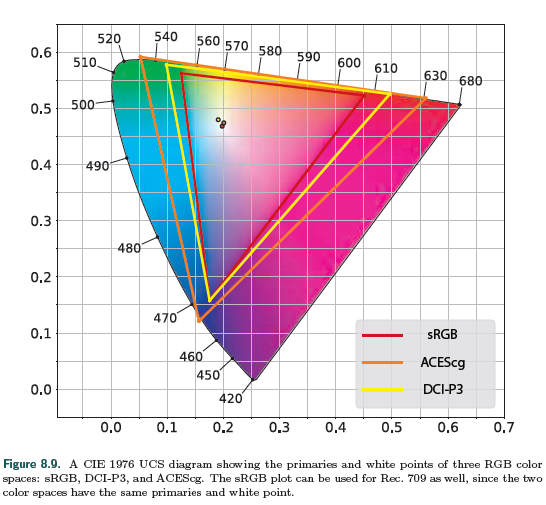

​	上图三个RGB颜色空间,sRGB在real-time readering中最常用.注意,本章使用"sRGB color space"是指具有sRGB原色和白点的线性颜色空间,而不是5.6讨论nonlinear sRGB 颜色编码.大多数计算机显示器为使用sRGB颜色空间,同样的原色和白点也适用于rec.709颜色空间,用于HDTV显示器,因此对游戏机很重要.但,更多显示器使用更广色域.某些显示器为了照片编辑设计而使用Adobe 1998 color space.为未来的电影设计的DCI-P3颜色空间也被广泛使用.Apple的产品线就使用了这个颜色空间.DCI-P3常被用做UHD实际颜色空间,尽管ultra-high definition(UHD)内容和显示器使用极宽的色域Rec. 2020 color space，它很接近第三颜色空间--ACEScg.

​	ACEScg颜色空间由Academy for motion Picture Arts和 Sciences(AMPAS)为电影的计算机图像渲染开发.它不是用作显示的颜色空间,而是用于渲染,渲染后的颜色会转换为显示颜色空间.

​	虽然目前sRGB颜色空间在实时渲染领域无处不在,使用更广颜色空间的时候也在增加.最直接的好处是针对广域显示器的应用,即使是针对sRGB或rec.709显示器的应用也有优势.在不同颜色空间中执行的常规渲染操作（如乘法）会产生不同结果,证据表明，在DCI-P3或ACESCG空间中执行这些操作比在线性SRGB空间中执行这些操作产生更准确的结果.

​	从RGB空间到XYZ空间的转换是线性的,可以使用从RGB空间的primaries和白点派生的矩阵来完成.通过矩阵求逆和级联,矩阵能将XYZ颜色空间的值转换为任意RGB颜色空间值或者在两个RGB颜色空间转换.这些颜色超出了色域,即在目标RGB空间中不可复制.可以使用各种方法将这些颜色映射到目标RGB色域中。	

​	一种常用的转换时将RGB颜色转换为luminance亮度值.因为luminance时系数Y,这个操作是RGB-to-XYZ转换中"Y"分量的操作.换句话说,它是RGB系数和RGB-to-XYZ矩阵的中间行的点积(dot product),假设使用sRGB颜色和Rec.709颜色空间,这个方程为:

​	$Y=0.2126R+0.7152G+0.0722B.$

​	再次看光度曲线,如第271页图8.4所示.这条曲线，代表一个标准的观察者的眼睛对各种光线的反应.波长,乘以三个主色系的光谱功率分布,每一条生成的曲线都是完整的。这三个结果的权重构成了上面的亮度方程.灰度强度值不相等的原因部分红色、绿色和蓝色是因为眼睛对各种各样的光的波长.

​	色度学可以告诉我们两种颜色刺激是否匹配,但它不能预测他们的外表。给定的XYZ颜色刺激的外观在很大程度上取决于关于照明、周围颜色和以前的条件等因素.Color apperance models(颜色外观模型，CAM)如CIECAM02试图解决这些问题,以及防止这种错误和预测最终颜色值.

​	颜色外观建模是视觉感知更广泛领域的一部分,包括遮盖等效果.这就是放置在物体上的高频高对比度图案往往隐藏瑕疵的地方.换言之,像波斯地毯这样的纹理将有助于伪装色带和其他着色工件,这意味着这样的表面需要花费更少的渲染工作.	

### 8.1.4 Rendering with RGB Colors

​	严格地说，RGB值代表的是感性的而不是物理量，将它们用于基于物理的渲染在技术上是一个类别错误。正确的方法是对光谱量进行渲染计算，通过密集采样或投影到适当的基础上表示，并仅在结束时转换为RGB颜色.

​	例如，最常见的渲染操作之一是计算从对象重新导入的灯光。物体的表面通常会比其他波长的光再吸收更多，正如其光谱再吸收曲线所描述的那样。严格正确的颜色计算方法入射光将入射光的SPD乘以每个波长的光谱反射，得到SPD。重新受影响的光线，然后将其转换为RGB颜色。相反，在RGB渲染器中，灯光和曲面的RGB颜色相乘在一起，得到重新受影响的灯光的RGB颜色。在一般情况下，这并不能给出正确的结果。	

​	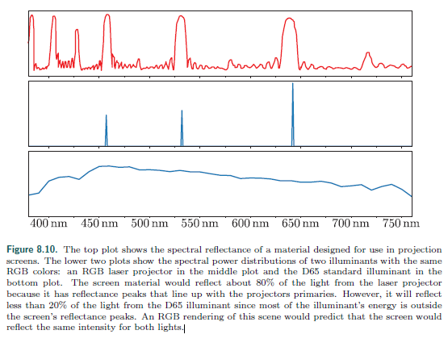

​	上图显示了设计用于投影屏幕的材料的光谱反射率。下面两个图显示了具有相同RGB颜色的两个光源的光谱功率分布：中间图中的一个RGB激光投影仪和底部图中的d65标准光源。由于屏幕材料的反射峰与投影机的主反射峰一致，因此它将重新吸收大约80%的激光投影机发出的光。但是，它将反射来自d65光源的不到20%的光，因为光源的大部分能量在屏幕的反射峰之外。该场景的RGB渲染将预测屏幕将为两个灯光反射相同的强度。

​	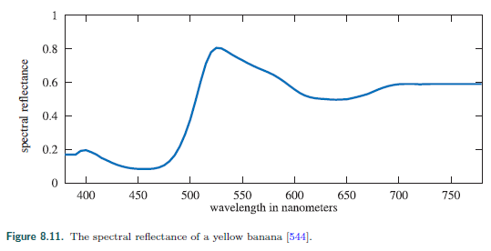

​	我们的例子展示了一种设计用于激光投影仪的屏幕材料。它在窄带内具有与激光投影机波长匹配的高反射率，在大多数其他波长上具有低反射率。这会使它反射来自投影机的大部分光，但会吸收来自其他光源的大部分光。在这种情况下，RGB渲染器将产生严重错误。

​	然而，图8.10所示的情况远不是典型的。实践中遇到的表面光谱反射曲线更平滑，如图8.11所示。典型的光源SPD类似于D65光源，而不是示例中的激光投影仪。当光源SPD和表面光谱反射均平滑时，由RGB渲染引入的误差相对较小。

​	在预测性渲染应用程序中，这些细微的错误可能很重要。例如，两条光谱反射曲线在一个光源下可能具有相同的颜色外观，但在另一个光源下没有。例如，在对修理过的车身零件进行喷漆时，这个问题被称为偏聚故障或光源偏聚现象。在试图预测这种效果的应用程序中，RGB渲染不合适。

​	在与渲染软件中这些错误会很严重,例如,两条光谱反射曲线在一个光源下可能具有相同的颜色外观,但在另一个光源下没有.这个问题被称为偏聚故障或光源偏聚现象.在对修理过的车身零件进行喷漆时试图预测这种效果的应用程序中常用,RGB渲染不合适.

​	但在主流渲染系统、尤其是交互式软件中，RGB渲染工作良好.即使是离线渲染的超现实电影也只是最近才开始采用光谱渲染,而且还远未普及.

​	本节仅涉及色彩科学的基础知识，主要是为了使人们认识到光谱与三重色之间的关系，并讨论设备的局限性。下一节将讨论相关主题“渲染场景颜色到显示值的转换”。

## 8.2 Screne to Screen

​	后续章节聚焦PBR,对于虚拟场景，基于物理的渲染的目标是计算场景中真实存在的辐射度。然而，到那时这项工作还远远没有完成。仍然需要确定显示器帧缓冲区中最终像素值。在这一节中，我们将讨论这个决定中涉及的一些考虑因素。

###  8.2.1 High Dynamic Range Display Encoding

​	281.本节建立在5.6基础上(它解释了显示编码).本节讨论HDR,需要基础知识:color gamuts(色域,也就是颜色空间).

​	5.6讨论的显示编码基于standard dynamic range(SDR)的使用sRGB显示标准的显示器,SDR电视使用Rec. 709 和Rec .1886标准.二者都有相同的RGB gamut和white point(D65).相似的(不完全相同)的非线性编码曲线,它们参考白亮度等级也相似(80 $cd/m^2$ for sRGB,100 $cd/m^2​$ for Rec.709/1886).示器和电视制造商并没有严格遵守这些亮度规格,他们实际上倾向于生产具有更亮白色水平的显示器.

​	HDR使用Rec. 2020和Rec. 2100标准.Rec. 2020定义了一个更广的色域,见8.12,whte piont仍为(D65).Rec. 2100定义了两个非线性显示编码:perceptual quantizer(PQ,感知量化器)和hybrid log-gamma(HLG,混合对数伽马).HLG在渲染领域鲜有使用,我们会聚焦PQ--峰值亮度为10000 $cd/m^2​$.

​	尽管峰值亮度和色域对编码很重要,它们在实际显示中也会造成一些问题.实际很少有HDR显示器的峰值亮度等级达到了1500 $cd/m^2$.应用中,显示器的峰值色域更接近DCI-P3(见8.12)而不是Rec. 2020.因此，HDR显示器从标准规降低到实际显示功能执行内部的tone(映射)和色域匹配(gammut mapping).此映射可能受应用程序传递的元数据的影响,以指示内容的实际动态范围和范围.

​	软件实现上有三条路线将图像转换到一个HDR显示器.但根据显示器和操作系统不过所有方案都能可行.

​	1.HDR10--被HDR显示器和操作系统普遍支持.framebuffer的每个像素占32bits(RGB:10bits*3,alpha:2bits),它使用PQ非线性编码和Rec. 2020颜色空间.每个HDR10 显示器模型有自己的tone mapping--没有标准化和文档化.

​	2.scRGB(linear variant)--只有windows操作系统支持.名义上，它使用sRGB图元和white level，尽管两者都可以超过，因为标准支持小于0和大于1的rgb值。帧缓冲区格式为每个通道16位，并存储线性RGB值。它可以与任何HDR10显示器一起工作，因为驱动程序转换为HDR10。它主要用于方便和向后兼容sRGB。

​	3.Dolby Vision(杜比视频高动态技术)-专有格式，在显示器或显示器上尚未广泛支持任何控制台（在编写时）。它使用定制的每通道12位帧缓冲格式，并使用PQ非线性编码和Rec.2020颜色空间。显示内部色调映射是跨模型标准化的（但不是文件化).

​	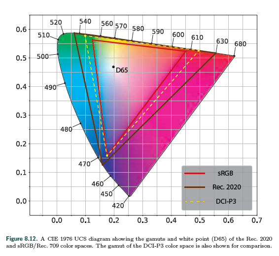

​	Lottes支出有第四种方法:如果仔细调整曝光和颜色，则可以通过常规的SDR信号路径驱动HDR显示器，效果良好。

​	对于scRGB以外的任何选项，作为显示编码步骤的一部分，应用程序需要将像素RGB值从渲染工作空间转换为Rec.2020，需要3 x 3矩阵转换，并应用PQ编码，这比Rec.709或sRGB编码功能要贵一些[497][497]。帕特里[1360][1360]给出了一个价格低廉的PQ曲线近似值。在HDR显示器上合成用户界面（UI）元素时需要特别小心，以确保用户界面清晰、亮度舒适[672][672]

### 8.2.2 Tone Mapping

​	5.6和8.2.1会讨论显示编码--将线性辐射值转换显示器物理硬件的非线性编码值的技术显示编码所应用的函数与显示器的光电传递函数（EOTF）相反,它确保输入的线性值与线性辐射匹配.由显示器发出.我们之前的讨论重点为在渲染和显示编码之间发生的一个重要步骤,我们现在准备探讨这个步骤.

​	*tone mapping*(色调映射) 或 *tone reproduction*是将屏幕辐射值转换为显示器辐射值的过程.这个过程的转换成为"end-to-end transfer function"或"scene-to-screen transfer function".image state的关键是理解tone mapping.这有两个基础的image states.Scene-referred images 指场景辐射值;display-referred images指显示辐射值.Image state与编码无关.任何状态的图像有可能是线性编码也可能是非线性编码.图8.13展示了图像状态、色调映射和显示编码的方式在图像处理管道中，处理从初始渲染到最终显示的颜色值。

​	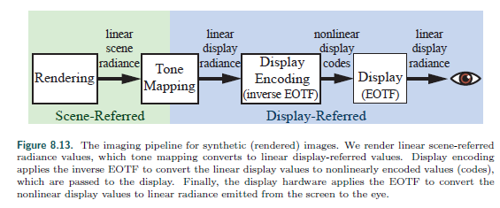

​	关于色调映射的目标，有几个常见的误解。这并不是为了确保场景到屏幕的转换是一种身份转换，而是为了在显示器上完美地再现场景辐射值。它也不能将场景的高动态范围中的每一点信息“挤压”到低动态范围中。尽管考虑到场景和显示动态范围之间的差异，但显示的动态范围确实起着重要作用。	

​	为了理解tone mapping,最好将之视为图像复制实例.图像复制的目标是创建一个(尽可能近距离,给定显示属性和视角)原观察场景的复制的图像.

​	有一种图像复制的目标略有不同.首选图像复制旨在创建一个显示参考图像,在某种意义上比原始场景看起来更好.将在8.2.3讨论.

​	再现与原始场景相似的感性印象的目的是具有挑战性的是，考虑到典型场景中的亮度范围超过了显示能力的几个数量级。AT的饱和度（纯度)至少场景中的一些颜色也可能远远超过显示功能.然而，摄影、电视和电影确实产生了令人信服的效果。与文艺复兴时期的画家一样，原始场景的感性相似性。这一成就利用人类视觉系统的某些特性是可能的.

​	觉视系统补偿绝对亮度的偏差，一种能力称为适应。由于这种能力，一个户外场景的复制显示在昏暗的房间里的屏幕上可以产生与原始场景相似的感觉，尽管复制品的亮度小于原版的1%。然而，适应提供的补偿是不完善的。在较低的亮度水平下，感知对比度降低（Stevens EECT），感知对比度也降低。（亨特·埃科特）	

​	然而，相比之下，这种增长加剧了一个现有的问题。由于场景的动态范围通常比显示器的动态范围大得多，因此我们必须选择一个亮度值的窄窗口进行复制，该窗口上下的值将被剪裁为黑色或白色。增强对比度会进一步缩小此窗口。为了部分抵消暗值和亮值的剪切，软滚动用于恢复阴影和高光细节。

​	所有这些都会导致一个乙状结肠（S形）音调再现曲线，类似于光化学薄膜提供的曲线。这不是意外。柯达和其他公司的研究人员仔细调整了光化学薄膜乳剂的性能，以产生有效且令人满意的图像复制。由于这些原因，在讨论声调映射时经常出现形容词“电影化”。

​	曝光的概念对于色调映射至关重要。摄影，曝光指控制落在lm或传感器上的光量。然而，在渲染中，曝光是在引用的场景上执行的线性缩放操作。在应用色调复制转换之前的图像。暴露的棘手方面确定要应用的比例因子。调子的复制转换和曝光是紧密联系在一起的。音调变换通常是用期望它们将应用于已曝光的场景参考图像一定的方式。	

​	通过曝光缩放然后应用色调复制变换的过程是一种全局色调映射，其中相同的映射应用于所有像素。相比之下，局部色调映射过程使用不同的映射，基于周围像素和其他因素，将像素映射到像素。实时应用程序几乎只使用全局色调映射（少数例外），因此我们将重点讨论这种类型，讨论第一色调复制转换，然后曝光。

​	重要的是要记住，场景引用的图像和显示引用的图像是根本不同的。物理操作仅在对场景引用的数据执行时有效。由于显示的局限性以及我们讨论过的各种感知效果，两种图像状态之间总是需要进行非线性变换。

#### Tone Reproduction Transform

​	scene-referred 指根据场景烘焙得到的图像

​	display-referred 指显示器用到的图像

​	色调复制变换.将场景-输入图像值通过一维曲线映射为显示输出图像.这条曲线可以独立作用于R、G、B或亮度.在前一种情况下，结果将自动显示在显示范围内，因为每个显示引用的RGB通道值都将介于0和1之间。但是，在RGB通道上执行非线性操作（尤其是剪切）可能会导致饱和度和色调的偏移，以及亮度的期望偏移。乔尔根尼和马登指出，饱和状态的转变在知觉上是有益的。大多数复制转换用来抵消史蒂文斯效应（以及环绕和观看都是效果）的对比度增强将导致相应的饱和增强，这也将抵消狩猎效应。然而，色调变化通常被认为是不可取的，现代色调转换试图通过在色调曲线后应用额外的RGB调整来减少它们。

​	通过将tone 曲线作用于亮度(luminance),色调(hue)和饱和度(saturation)能够避免或减少偏移(shifts).但这可能会导致显示图像的颜色超过显示器的RGB色域--需要映射回去.

​	调映射的一个潜在问题是，将非线性函数应用于场景引用的像素颜色可能会导致某些抗锯齿技术出现问题。这个问题在5.4.2讨论.

​	*这有一些关于tonemap曲线的介绍和论文索引*

​	Reinhard tone 算法[1478][1478]是最早应用于实时渲染的色调映射转换. 它让较暗值不变,让较亮的值渐进的编委白色.Drago等提出了一个类似的tone-mappinng算法[375][375]--调整输出显示的亮度以适应HDR显示器.Duiker创建了用于视频游戏的一个柯达胶片近似曲线[391,392][391,392].这个曲线后来被Hable[628][628]修改添加了更多控制参数,用于休息"Uncharted 2"(神秘海域2).这个曲线影响深远,一些游戏中都用了"Hable filmic curve".Hable后来又提出了一个新的更好的曲线[634][634].

​	Day[330][330]创建了一个s型曲线被用于Insomniac Games和Call of Duty:Advanced Warfacre.Gotanda[571,572][571,572]创建了一个模拟胶片和数码相机的响应.

传感器。这些曲线被用于*Star Ocean 4*等游戏.lottes[1081][1081]指出,显示器对显示器有效动态范围的影响是显著的,并且高度依赖于室内照明条件.因此，提供用户可调整的tone-mapping曲线很重要.他提出了一种tone复制转换,支持这种可用于SDR和HDR显示器的调整.

​	*Academy Color Encoding System*(ACES)由Science and Technology Council of the Academy of Motion Picture Arts(电影艺术学院科学技术委员会)为电影和电视行业提供色彩管理管理而拟定的标准.第一部分是参考渲染转换(reference rendering transform,RRT),它将场景参考值转换为标准设备中性输出空间中的显示参考值(称为输出颜色编码规范(output color encoding specification,OCES)).第二部分是输出设备转换(output device transform,ODT),将OCES转换为最终显示编码.有许多不同的ODTs,每种都为特定的显示设备和观察情况设计的.RRT和适当的ODT的串联创建了整体转换.这种模块化结构便于处理各种显示设备和观察条件.Hart[672]建议对需要同时支持SDR和HDR显示的应用程序进行ACES tone mapping转换.

​	虽然ACES是为电影和电视机设计的,但它在实时软件中应用正快速增长.UE[1802][1802]默认支持ACES tone mapping(见TonemapCommon.hlsl).Unity[1801][1801]也支持它(见[Unity-Technologies/PostProcessing][https://github.com/Unity-Technologies/PostProcessing.git]的ColorGrading.cs和Colors.hlsl Lut2DBaker.shader).和Patry[1359][1359]一样,Narkowicz给出了一个适配SDR和HDR ODTs的ACES RRT[1260, 1261][1260, 1261].Hart[672][672]给出了一个参数可控的ACES ODTs来支持大量不同的设备.

​	HDR显示器的Tone mapping需要注意,应为显示器也有自己的色调映射.Fry[497][497]展示了Frostbite (寒霜)游戏引擎中用到的一系列tone mapping转换.它们对SDR显示器应用了相对激进的色调映射曲线,对使用HDR10信号路径的显示器应用了较不激进的色调映射曲线(根据显示器的峰值亮度有一些变化),而对使用杜比视觉路径的显示器不应用色调映射(换句话说,它们依赖内置的杜比视觉色调映射显示器.Frostbite tone 映射曲线被设计为中性的--没有对对比度和色调的明显的改变.目的是通过应用color grading(见8.2.3),应用任何所需的对比度和色调调整.为此,色调映射转换时在$IC_TC_P​$颜色空间[364][364]进行--改颜色空间旨在实现色度轴(chrominance)和亮度轴(luminance axes)之间的均匀性和正交性.Frostbite 通过变换色调映射亮度并随着亮度趋近白色(display white)而逐渐降低饱和度,这提供了一种没有色调(hue)偏移的感觉得变换.见[安柏霖的博文寒霜引擎的HDR渲染探索][https://blog.csdn.net/toughbro/article/details/78148891].

​	具有讽刺意味的是,为了在之前的转换中利用色调变化而得到的资源（如重效果）出现问题后，寒霜团队最终修改了转换,使用户能够重新引入某种程度的色调变化,以显示所引用的颜色.

### Exposure

​	曝光.(之后我会尝试结合unity,ue4,overwatch的bloom来分析bloom是怎么回事以及实际中应该如何考虑效果和效率).

​	计算曝光的通用的技术家族依赖于场景亮度值.为了避免阻塞,通常使用采样上一帧的结果.

​	遵循Reinhard等的建议[1478][1478]早起实现中使用的一个度量是场景平均亮度值的对数平均(log-average),通常,曝光是通过计算帧的对数平均数来确定的[224,1674][224,1674],这个对数平均值通过后处理passes中的一系列降采样直到最后一个值得到.

​	使用平均值会导致对异常值敏感,比如少量明亮的像素会影响整个帧的曝光.之后的实现尝试通过使用亮度值的柱状图来解决这个问题,柱状图中的数据点可用于改进结果.比如,在一个接一个的橙色

随后的实现通过使用亮度值的柱状图来改善这个问题.而不是平均值,柱状图允许计算中位数，这是更强大的。柱状图中的其他数据点可用于改进结果.例如,The Orange Box(半条命2)中基于第95个百分位和中位数的启发式方法被用来确定暴露量[1821][1821].Mittring描述了使用计算着色程序生成亮度柱状图[1229][1229]。

​	但是目前讨论的技术的问题是:像素的亮度对于得到曝光而言是一个错误的单位.如果我们看看摄影实践,例如Ansel Adams的分区曝光法(Zone System)[10][10]以及如何使用入射光度表来设置曝光,那么很明显,最好单独使用光照(不受表面反照率的影响)来确定曝光[757][757].这么做是有效的,因为相机曝光是用来抵消光线的.这就产生了一种主要显示物体表面颜色的印刷品,这与人类视觉系统的颜色恒定性(color constancy)相对应.这种方式处理曝光能确保传递给tone transform正确的值.比如大多数电影或电视厂商的tone transforms采用曝光场景值0.18映射到显示值0.1--期望0.18表示主场景18%灰度值[1418, 1602][1418, 1602].

​	这个模拟已经在开始使用了.比如合金装备5(MetalGear Solid V:Ground Zeroes)有一个基于光照强度的曝光系统[921][921].在许多游戏中,静态曝光级别是根据已知的场景照明值为环境的不同部分手动设置的.这样做可以避免曝光中的意外动态变化.	

### Color Grading

​	8.22中提及再加工图像,目的是为了让它比原图像看起来更好.通常,这涉及到对图像颜色的创造性操作,这一过程称为颜色分级(color grading).(注意与tone mapping联系与区分).

​	数字色彩分级技术在电影行业已经应用了一段时间.早起例子如电影"逃狱三王"(O Brother, Where Art Thou?(2000))和"天使爱美丽"(Amelie(2001)).Color Grading通常通过交互操作示例场景图像中的颜色来执行,直到实现所需的创造性“外观”.然后在一个快照或序列中的所有图像上重新应用相同的操作序列.Color Grading从电影到游戏都有,现在在那里被广泛使用[392, 424, 756, 856, 1222][392, 424, 756, 856, 1222].

​	Selan[1601][1601]演示了如何“烘焙”从Color Grading或图像编辑应用程序到三维颜色查找表（LUT）的任意颜色转换.这个表将输入的R,G,B视为x,y,z坐标在表中查找对于的点的值作为输出颜色.英雌该技术可以用于任何需要根据输入得到输出的映射--只要不超过LUT的限制.Selan的烘焙过程从获取一个标识LUT(将每个输入颜色映射到相同颜色的标识LUT)开始,然后将之“切片”以创建二维图像.然后将此切片的LUT图像加载到Color Grading应用程序中,并对其应用拒绝所需创造性外观的操作.需要注意的是,只对LUT应用颜色操作,避免空间操作,如模糊.然后将编辑的LUT保存下来,“打包”成三维GPU(或2D)纹理,在渲染应用程序中用于动态应用相同的颜色转换以渲染像素.Iwanicki[806][806]提出了一种巧妙的方法,可以在使用最小二乘法最小化的LUT中存储颜色转换时减少采样误差.

​	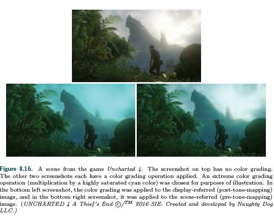

​	上图是神秘海域4的一个场景图像.上侧图像无Color Grading.左下为display-referred(post-tone-mapping)color grading.右下为scene-referred(pre-tone-mapping)color grading.

​	在之后的出版中,Selan[1602][1602]区分了两种color grading方式.一种方法是对scene-referred颜色进行color grading.另一种方法是对通过显示预览转换的display-referred数据执行color grading.虽然display-referred color grading更简单,但是scene-referred color grading可以产生更高的精细度结果.

​	当实时软件采用color grading时,display-referred方法已经占据主导地位[756,856][756,856].然而,由于其较高的视觉质量,场景参考方法自那时起就获得了吸引力[198,497,72][198,497,72],如图8.16所示.通过Scene-referred 数据进行color gradign还能降映射曲线烘焙到LUT[672][672]以节省计算了--如神秘海域4的做法[198][198].

​	在LUT前,scene-referred 数据必须压缩到[0,1][1601][1601][1601].寒霜引擎的知觉量化器(perceptual quantizer OETF)就是用于这个目的,尽管能用更简单的曲线.Duiker[392][392]使用了一个对数曲线,Hable建议使用一次或两次平方根计算.

​	Hable[635][635]对常见的颜色分级操作和实施注意事项进行了很好的概述.

## 总结

​	光的辐射通过 CIE XYZ得到CIE XYZ颜色空间的三颜色值 $CIE_{XYZ}$

$CIE_{XYZ}$可以通过。。得到亮度和色度

通过XYZ颜色空间中转,以原点和白点辅助,可以实现任意RGB颜色空间转换.

比如亮度计算公式就是RGB-to-XYZ的Y分量的计算

## 扩展

​	色度学和颜色科学的圣经是Wyszecki和斯蒂尔斯的[1934][1934].其他良好的比色法参考包括通过Hunt[789][789]和Fairchild[456][456]的彩色外观模型.Selan的白皮书[1602][1602]对图像复制和.“场景到屏幕”问题.希望进一步了解此主题的读者通过Hunt[788][788]和数字色彩管理来复制色彩作者:乔尔根尼和马登[537][537]为优秀的参考文献.里面的三本书安塞尔亚当斯摄影系列[9，10，11][9，10，11],尤其是底片,提供了一个理解的艺术和科学长征摄影如何影响理论和实践的图像复制到今天.最后，Reinhard等人的《彩色成像：基础和应用》[1480][1480]一书对整个研究领域进行了全面的概述.

## 引用

[9]: Adams, Ansel, The Camera, Little, Brown and Company, 1980. Cited on p. 291

[10]: Adams, Ansel, The Negative, Little, Brown and Company, 1981. Cited on p. 289, 291

[11]: Adams, Ansel, The Print, Little, Brown and Company, 1983. Cited on p. 291

[198]: Brinck, Waylon, and Andrew Maximov, "The Technical Art of Uncharted 4," SIGGRAPH
production session, July 2016. Cited on p. 290

[224]: Calver, Dean, "Deferred Lighting on PS 3.0 with High Dynamic Range," in Wolfgang Engel,ed., ShaderX3, Charles River Media, pp. 97{105, 2004. Cited on p. 288

[330]: Day, Mike, "An Effcient and User-Friendly Tone Mapping Operator," Insomniac R&D Blog,Sept. 18, 2012. Cited on p. 286

[364]: Dolby Laboratories Inc., "ICtCp Dolby White Paper," Dolby website. Cited on p. 276, 287

[375]: Drago, F., K. Myszkowski, T. Annen, and N. Chiba, \Adaptive Logarithmic Mapping for
Displaying High Contrast Scenes,' Computer Graphics Forum, vol. 22, no. 3, pp. 419{426,

2003. Cited on p. 286

[391]: Duiker, Haarm-Pieter, and George Borshukov, \Filmic Tone Mapping," Presentation at Electronic Arts, Oct. 27, 2006. Cited on p. 286
[392]: Duiker, Haarm-Pieter, "Filmic Tonemapping for Real-Time Rendering," SIGGRAPH Color
Enhancement and Rendering in Film and Game Production course, July 2010. Cited on
p. 286, 288, 289, 290

[424]: Endres, Michael, and Frank Kitson, "Perfecting The Pixel: Rening the Art of Visual Styling,"Game Developers Conference, Mar. 2010. Cited on p. 289

[456]: Fairchild, Mark D., Color Appearance Models, Third Edition, John Wiley & Sons, Inc., 2013.Cited on p. 276, 278, 291

[497]: Fry, Alex, "High Dynamic Range Color Grading and Display in Frostbite," Game Developers Conference, Feb.{Mar. 2017. Cited on p. 283, 287, 288, 290

[537]: Giorgianni, Edward J., and Thomas E. Madden, Digital Color Management: Encoding Solutions,Second Edition, John Wiley & Sons, Inc., 2008. Cited on p. 286, 291

[571]: Gotanda, Yoshiharu, "Star Ocean 4: Flexible Shader Management and Post-Processing,"
Game Developers Conference, Mar. 2009. Cited on p. 286
[572]: Gotanda, Yoshiharu, "Film Simulation for Videogames," SIGGRAPH Color Enhancement and Rendering in Film and Game Production course, July 2010. Cited on p. 286

[628]: Hable, John, "Uncharted 2: HDR Lighting," Game Developers Conference, Mar. 2010. Cited on p. 286, 288

[634] Hable, John, "Filmic Tonemapping with Piecewise Power Curves," Filmic Worlds Blog, Mar.26, 2017. Cited on p. 286

[667]: Harada, Takahiro, Jay McKee, and Jason C. Yang, "Forward+: A Step Toward Film-Style
Shading in Real Time," in Wolfgang Engel, ed., GPU Pro4, CRC Press, pp. 115{135, 2013.
Cited on p. 887, 895, 896, 897, 904

[672]: Hart, Evan, "UHD Color for Games," NVIDIA White Paper, June 2016. Cited on p. 161,
165, 278, 281, 283, 287, 290

[756] Hoffman, Naty, "Color Enhancement for Videogames," SIGGRAPH Color Enhancement andRendering in Film and Game Production course, July 2010. Cited on p. 289, 290

[757]: Hoffman, Naty, "Outside the Echo Chamber: Learning from Other Disciplines, Industries,and Art Forms," Opening keynote of Symposium on Interactive 3D Graphics and Games,Mar. 2013. Cited on p. 284, 289

[788]: Hunt, R. W. G., The Reproduction of Colour, Sixth Edition, John Wiley & Sons, Inc., 2004.
Cited on p. 291

[806]: Iwanicki, Micha l, "Lighting Technology of The Last of Us," in ACM SIGGRAPH 2013 Talks,
ACM, article no. 20, July 2013. Cited on p. 229, 289, 467, 476, 486, 498

[856] Kaplanyan, Anton, "CryENGINE 3: Reaching the Speed of Light," SIGGRAPH Advances in
Real-Time Rendering in Games course, July 2010. Cited on p. 196, 289, 290, 848, 849, 887,
892

[921]: Kojima, Hideo, Hideki Sasaki, Masayuki Suzuki, and Junji Tago, "Photorealism Through the Eyes of a FOX: The Core of Metal Gear Solid Ground Zeroes," Game Developers Conference, Mar. 2013. Cited on p. 289

[1081]: Lottes, Timothy, "Advanced Techniques and Optimization of -HDR- VDR Color Pipelines,"Game Developers Conference, Mar. 2016. Cited on p. 281, 286, 1010

[1222] Mitchell, Jason, Gary McTaggart, and Chris Green, "Shading in Valve's Source Engine,"
SIGGRAPH Advanced Real-Time Rendering in 3D Graphics and Games course, Aug. 2006.
Cited on p. 289, 382, 402, 499

[1229]: Mittring, Martin, "The Technology Behind the `Unreal Engine 4 Elemental Demo'," Game Developers Conference, Mar. 2012. Cited on p. 288, 371, 383, 495, 526, 536, 571

[1260]: Narkowicz, Krzysztof, "ACES Filmic Tone Mapping Curve," Krzysztof Narkowicz blog, Jan.
6, 2016. Cited on p. 287
[1261]: Narkowicz, Krzysztof, "HDR Display|First Steps," Krzysztof Narkowicz blog, Aug. 31, 2016.Cited on p. 287

[1359]: Patry, Jasmin, "HDR Display Support in Infamous Second Son and Infamous First Light
(Part 1)," glowybits blog, Dec. 21, 2016. Cited on p. 287

[1360]: Patry, Jasmin, "HDR Display Support in Infamous Second Son and Infamous First Light
(Part 2)," glowybits blog, Jan. 4, 2017. Cited on p. 283

[1418]: Pines, Josh, "From Scene to Screen," SIGGRAPH Color Enhancement and Rendering in
Film and Game Production course, July 2010. Cited on p. 285, 289

[1478]: Reinhard, Erik, Mike Stark, Peter Shirley, and James Ferwerda, \Photographic Tone Reproduction for Digital Images," ACM Transactions on Graphics (SIGGRAPH 2002), vol. 21,
no. 3, pp. 267{276, July 2002. Cited on p. 286, 288

[1480]: Reinhard, Erik, Erum Arif Khan, Ahmet Oguz Akyuz, and Garrett Johnson, Color Imaging:Fundamentals and Applications, A K Peters, Ltd., 2008. Cited on p. 291

[1601]: Selan, Jeremy, "Using Lookup Tables to Accelerate Color Transformations," in Matt Pharr,ed., GPU Gems 2, Addison-Wesley, pp. 381{408, 2005. Cited on p. 289, 290

[1602]: Selan, Jeremy, "Cinematic Color: From Your Monitor to the Big Screen," VES White Paper,Cited on p. 166, 283, 289, 290, 291

[1674]: Sousa, Tiago, "Adaptive Glare," in Wolfgang Engel, ed., ShaderX3, Charles River Media,
pp. 349{355, 2004. Cited on p. 288, 527

[1706]:  Stone, Maureen, A Field Guide to Digital Color, A K Peters, Ltd., Aug. 2003. Cited on p. 276

[1802]: Unreal Engine 4 Documentation, Epic Games, 2017. Cited on p. 114, 126, 128, 129, 262, 287, 364, 611, 644, 920, 923, 932, 934, 939

[1821]: Vlachos, Alex, "Post Processing in The Orange Box," Game Developers Conference, Feb.Cited on p. 288, 538