[TOC]

## 1 Physics of Light

### 基本概念

可见光波长400~700 nm

能量

辐射度

### 定义

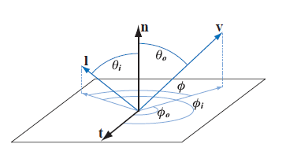

| 符号        | 定义       | 说明                 |
| ----------- | ---------- | -------------------- |
| $\vec l$    | 光源方向   |                      |
| $\vec v$    | 视线反方向 |                      |
| $\vec p$    | 片元点     |                      |
| $\vec n$    | 法线       |                      |
| $c_{light}$ | 光源的颜色 |                      |
| $\vec l_c$  | 光源原点   |                      |
| $\vec r_i$  | 反射光线   | 与法线夹角$\theta_i$ |
|             |            |                      |

关键角度

| 符号     | 定义           | 说明 |
| -------- | -------------- | ---- |
| $\theta$ | 光线与法线夹角 |      |
|          |                |      |
|          |                |      |
|          |                |      |

Azimuth angles $\phi_i$ and  $\phi_0$are given with respect to a given tangent
vector $\vec t$. The relative azimuth angle $\phi$, used for isotropic BRDFs instead of  $\phi_i$ and $\phi_0$, does not require a reference tangent vector.

### Particles

### 介质

IOR n

> 原始波和新波的速度比

让波速减少的介质有衰减系数k(kappa)

### Surface

折射

$\frac{\sin(\theta_t)}{\sin(\theta_i)}=\frac{n_1}{n_2}$

微表面

### Subsurface Scattering

次表面散射

### BRDF

$$L_i(\vec c,-\vec v)=L_0(\vec p,\vec v) $$

> $$\vec c$$ 指camera pos
>
> $$\vec v$$ 指点到摄像机的射线
>
> $$\vec p $$ 指片元点,也就是view ray与surface的焦点(intersection)

## 2 Camera

## 4 BRDF(bidirectional reflectance distribution function)

$f(\vec l,\vec v)$

S(V)BRDF

#### 考虑折射率方程

$L_0(\vec p,\vec v) = \int_{\vec l \in \Omega}f(\vec l,\vec v)L_i(\vec p,\vec l)(\vec n \cdot \vec l)d\vec l$

$\vec l \in \Omega$ 

对于点$p$,起折射率为

$L_0(\vec v) =\int_{\vec l \in \Omega}f(\vec l,\vec v)L_i(\vec l)(\vec n \cdot \vec l)d\vec l$

在球坐标下，通常用角度$\phi$ 、$\theta$来描述

$d\vec l$ = $\sin(\theta_i)d\theta_id\phi_i$

$\vec n \cdot \vec l$ = $\cos\theta_i$

于是有

$L_0(\theta_0,\phi_0)=\int_{\phi_i=0}^{2\pi}\int_{\theta_i=0}^{\frac{\pi}{2}}f(\theta_i,\phi_i,\theta_0,\phi_0)L(\theta_i,\phi_i)\cos\theta_i\sin\theta_id\theta_id\phi_i$

> $\theta_i$
>
> $\phi_i$
>
> $\theta_0$
>
> $\phi_0$

BRDF只定义了view和light位于surface上方的情况

> 意味着$\vec n\cdot\vec l$需要calmp(0,)
>
> 为了避免除0，通常用abs($\vec n\cdot\vec l$)*0.00001

BRDF原则

>1. 互异性:$f(\vec l,\vec v)=f(\vec v,\vec l)$
>2. 能量守恒:输出能量<=输入能量

#### directional-hemispherical reflectance $R(\vec l)$

描述BRDF能量损失程度，也就是surface的粗糙度roughenss

$R(\vec l)=\int_{\vec v \in \Omega}f(\vec l,\vec v)(\vec n\cdot\vec v)d\vec v$         $\in[0,1]$

放射方程中的$\vec v$、$\vec l$  是整个半球的。。

类似的

$R(\vec v)=\int_{\vec l \in \Omega}f(\vec l,\vec v)(\vec n\cdot\vec v)d\vec l$

#### Lambertian BRDF

最简单的BRDF是Lambertian

其中$\vec n\cdot\vec l$ 项简化了

real-time rending常用

$f(\vec l,\vec v)是一个常数

$R(\vec l)=\pi f(\vec l,\vec v)$

漫反射(constant relfectance) diffuse color $c_{diff}$ 或者albedo $\rho$，次表面subsurface albedo $\rho_ss$

$f(\vec l,\vec v)=\frac{\rho_{ss}}{\pi}$

其中$\frac{1}{\pi}$时由于半球上积分余弦因子产生

 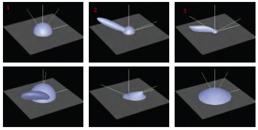

这里抽象一个模型，假设入射光恒定

输出为:diffuse,specular lobe,

>1上为Lambertian BRDF(简单球形)
>
>2.上为Blinn-Phong highlighting+Lambertian term
>
>3.上为Cook-Torrance BRDF
>
>1.下a close-up of Ward's anisotropic model。tilt the specular lobe
>
>2.下Hapke/Lommel -Seeliger "Lunnar surface " BRDF
>
>3.下Lommel-Seeliger scattering

## 5 Illumination

$L_i(\vec l)$ term 描述反射方程在shaded surface point的光

Global illumination(GI)通过光在整个场景的弹射等效果计算$L_i(\vec l)$,这种策略将反射考虑进来了。

这一节，描述的时local illumination，也就是假设一直$L_i(\vec l)$，计算每个点使用GI时该如何计算光照。

真实场景,$L_i(\vec l)$计算了所有方向的来自光源或表面反射的非0辐射,真实世界的光为area lights。本节讨论的时虚拟的方向光或精确坐标的光源

将方向光的影响极限趋近为0时，可以积分方程可以简化为单个计算更少的BRDF方程

$L_0(\vec v)=\pi f(\vec l_c,\vec v)c_{light}(\vec n\cdot\vec l_c)$

为了确保背面的光不被计算进来，$(\vec n,\vec l)$需要clamped to 0

$L_0(\vec v)=\pi f(\vec l_c,\vec v)c_{light}(\vec n\cdot\vec l_c)^+$

对于n个光源

$L_0(\vec v)=\pi \sum_{i=1}^n f(\vec l_{c_i},\vec v)c_{light_i}(\vec n \cdot \vec l_{c_i})^+$

其中$\vec l_{c_i}$为光源方向,$c_{light_i}$为光源颜色

其中$\pi$因子被BRDFs中出现的$\frac{1}{\pi}$抵消，但公式、论文中不能简化。

## 6 Fresnel Reflectance

物体的表面由其周围的介质和substance组成。光源在两个介质间相互作用遵守Fresnel equations(*Augustin-Jean Fresnel*).

菲涅尔对surface有几何假设:表面不含有光波波长的1~100倍的不规则

光与与表面作用后分成两部分：反射、折射

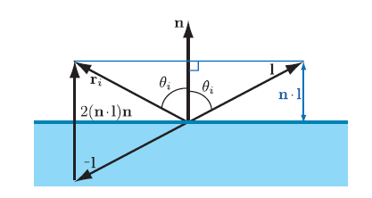

反射光用$\vec r_i$表示，它与$\vec n$夹角为$\vec \theta_i$,根据入射光线$\vec l$和$\vec n$可以计算的到

$\vec r_i = 2(\vec n\cdot \vec l)\vec n - \vec l$

反射的量由*Fresnel reflectance* F描述,该变量由$\theta_i$决定

$F(\theta_i)$ 当做RGB处理，规则

> * 当$\theta_i = 0^o$,也就是光线垂直入射时，有$F_0$,也被认为是该物质的镜面反射颜色，也叫垂直入射
> * 随着$\theta_i$上升，$F(\theta_i)$也上升，当$\theta_i = 90^o$,$F(\theta_i) = 1$ (白色)
> * 上升的曲线由物质决定，

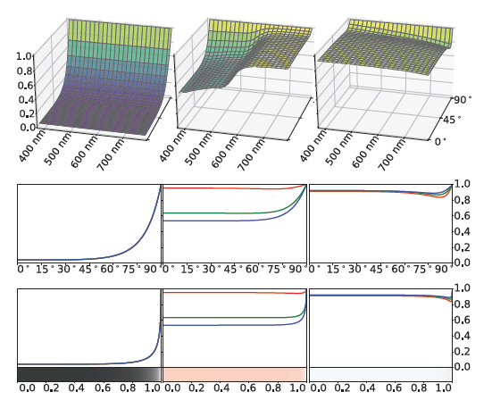
上图依次为:玻璃、铜、铝的Fresnel reflectance.可以看到，不同波长的光的曲线不同，不同物质相同波长的曲线不同。波长由可以找到对应光颜色，也就是不同颜色的光的反射结果不同。玻璃这种物质的F与光颜色无光。

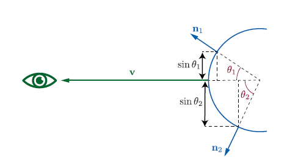

我们使用$F(\vec n,\vec l)$而不用$\theta_i$,Fresnel function时BRDF的一部分。

$F_0$由物质决定，在rough工作流，常简化

$F$项计算方法(Schlick):

$F(\vec n,\vec l)\approx F_0+(1-F_0)(1-(\vec n\cdot\vec l)^+)^5$

这个公式时白色和$F_0$的非线性差值结果。

另一种计算的方案(Gulbrandsen),不能用来实时计算。这个曲线更拟合金属的Fresnel equations。

对于Schlick,$F_0$只是一个参数，下面的方程介绍了如何通过两种介质的折射率计算$F_0$,这里用n代替了$n_2$,这里$n_1=1$(空气环境下)

$F_0={(\frac{n-1}{n+1})}^2$

该值转化为RGB颜色的公式在8.1.3介绍颜色空间时提及

软件中常用公式为

$F(\vec n,\vec l) \approx F_0 + (F_{90} - F_0)(1-(\vec n\cdot\vec l)^+)^{\frac{1}{p}}$

设置$F_{90}$为非白色可以描述Fresnel 方程无法描述的物质，比如覆盖物质上的灰尘

##### 常见物质的$F_0$

主要分三类：绝缘体(insulators),半导体(semiconductor),导体(conductor)

Dielectrics 的$F_0$很低，通常<=0.06,菲涅尔效果明显

对于未知物质通常使用0.04

| Dielectric      | Linear      | Texture(sRGB) | Color | Notes                                                        |
| --------------- | ----------- | ------------- | ----- | ------------------------------------------------------------ |
| Water           | 0.02        | 39            |       |                                                              |
| Living tissue   | 0.02-0.04   | 39-56         |       | Watery tissues are toward the lower bound, dry ones are higher |
| Skin            | 0.028       | 47            |       |                                                              |
| Eyes            | 0.025       | 44            |       | Dry cornea (tears have a similar value to water)         |
| Hair            | 0.046       | 61            |       |                                                              |
| Teeth           | 0.058       | 68            |       |                                                              |
| Fabric          | 0.04-0.056  | 53-67         |       | Polyester highest, most others under 0.05                    |
| Stone           | 0.035-0.056 | 53-67         |       | Values for the minerals most often found in stone            |
| Plastics, glass | 0.04-0.05   | 56-63         |       | Not including crystal glass                                  |
| Crystal glass   | 0.05-0.07   | 63-75         |       |                                                              |
| Gems            | 0.05-0.08   | 63-80         |       | Not including diamonds and diamond simulants                 |
| Diamond-like    | 0.13-0.2    | 101-124       |       | Diamonds and diamond simulants(e.g., cubic zirconia, moissanite) |

##### 金属的菲涅尔反射

金属的$F_0$很大，通常高于0.5

##### 半导体的菲涅尔反射

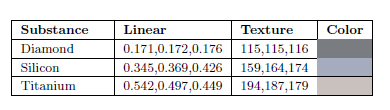

介于导体和绝缘体之间，范围为[0.2,0.45]

##### 水的菲涅尔反射

之前讨论的菲涅尔反射全是基于空气的，真空或者液体环境下值是不一样的，也就是不能假设$n_1 = 1$了，此时我们需要使用如下公式计算$F_0$

$F_0=(\frac{n_1-n_2}{n_1+n_2})^2$

通常$n_1\not= 1$是水下场景。也有可能是其他情况，比如雾

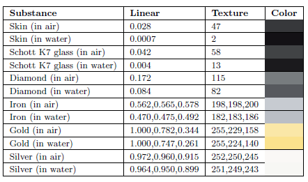

##### 参数化Fresnel Values

常用的参数化时将$F_0$和diffuse color $\rho_{ss}$合并，这种方法能是的金属这类无diffuse color和电解质具有一组受限的$F_0$.它包含一个RGB颜色$C_{surf}$和一个标量*m*--metallic/metalness

> * 如果$m=1$,$F_0$为$c_{surf}$,$\rho_{ss}是black;
> * 如果$m=0$,$F_0$为电解质值(是一个常量(0.04)或被额外参数控制的值),$c_{surff} = \rho_{ss}$

"metalness"最早被Brown University使用，电影$Wall-E$.迪士尼动画电影$Wreck-It$中的$Disney principled$光照模型中使用了一个额外的变量"specular"来控制$F_0$,这个参数化方法被Unreal Engine和Frostbite engine使用来描述非电解质的范围较广的$F_0$.游戏$Call of Duty:Infinite Warfare$使用压缩算法将两个值压缩为一个值，节省内存。$Overwatch$也是用了一种压缩算法：

mixed.rg为图片使用通道

$$metallic = saturate(2*mixed.r-1)^2;$$

$$diffuse = albedo.rgb*(1-metallic);$$

$$F_0=saturate(mixed.r-0.25)$$

$$F_0=F_0*0.06+0.02$$

$$specular=lerp(F_0,albedo,metallic)$$

$$onemiusref=(1-metallic)*(1-F_0)$$

多数实时渲染引擎使用metalness值而不直接使用$F_0$和$\rho_{ss}$是出于使用方便和节省G-buffer.在游戏*Call of Duty: Infinite Warfare*中，美术绘制$F_0$和$\rho_{ss}$的纹理，再通过压缩算法存储到一个同道中。

metalness工作流有几个缺点:它不能描述有些种类的材质，比如具有着色$F_0$的电镀金属。美术可以手动调整得到中间值。

另一个被实时渲染引擎使用的参数化技巧:除了特种抗折射涂层，没有一个材质的$F_0$时小于0.02的。这个技巧用来高亮边缘。这里没有使用额外的occ纹理，而是将小于0.02部分用来“关闭”菲涅尔边缘增强。这项技术被Schuler发明，用于UE和Frostbite engiens.

##### Internal Reflection

次表面反射

当$n_1>n_2$会发生次表面反射

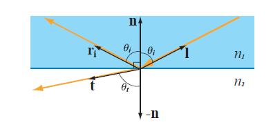

次表面只有绝缘体会有，

$\sin_{\theta_c}=\frac{n_2}{n_1}=\frac{1-\sqrt F_0}{1+\sqrt F_0}$

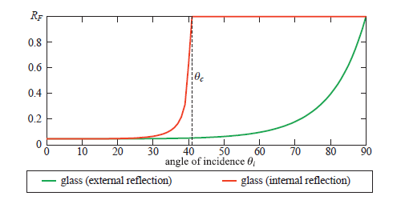

##### Microgeometry

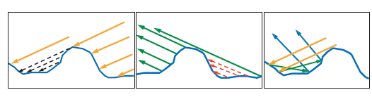

关于法线

## 7 Microfacet Theory

微表面理论

micro-BRDF $f_u(\vec l,\vec v,\vec m) $ 混合了所有微表面的反射光

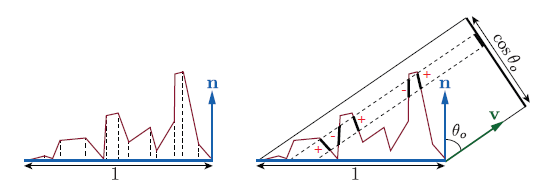

左侧，我们看到积分项$D(\vec m)(\vec n\cdot \vec m)$,

右侧，积分项$D(\vec m)(\vec v\cdot \vec m)$，$\cos(\theta_o)=(\vec v\cdot\vec n)$

称为*normal distribution function * or NDF,使用符号$D(\vec m)$表示,也称为D项,微表面法线的贡献，更有用的时积分$D(\vec m)(\vec n\cdot\vec m)$,$\Theta$表示对以$\vec n$为中心的整个球面积分

$\int_{m\in \Theta}D(\vec m)(\vec n\cdot\vec m)d\vec m = 1$

如果对以$\vec n$为中心的半球进行积分使用符号$\Omega$表示

在经验表明,heightfields,所有位于$\Omega$外的$\vec m$的$D(\vec m)=0$,但non-heightfields它是合法的

更通用的,从任何视线方向，微表面在视线垂直方向的投影都满足如下公式

$\int_{m\in\Theta}D(\vec m)(\vec v\cdot\vec m)d\vec m=\vec v\cdot\vec n$

注意$\cdot$没有clamp(0,1),右侧展示了原因.

渲染时,我们只考虑可见的微表面，可见微表面的投影面积之和等于宏观表面投影面积，这里提出新的一项G项,masking function $G_1(\vec m,\vec v)$来描述微表面的法线$\vec m$和视线$\vec v$的可见性，此时积分项为球面的$G_1(\vec m,\vec v)D(\vec m)(\vec v\cdot\vec m)^+$：

$\int_\Theta G_1(\vec m,\vec v)D(\vec m)(\vec v\cdot\vec m)^+d\vec m=\vec v\cdot\vec m$

$G_1(\vec m,\vec v)D(\vec m)$时可见的*normals*的贡献，

Smith $G_1$ function:

$G_1(\vec m,\vec v)=\frac{\chi^+(\vec m)\cdot\vec v}{1+\Lambda(\vec v)}$

$$\chi^+(x)= $$$
\left \{ 
\begin{array}{c}
1,where x < 0\\ 
0,where x \leq 0
\end{array}
\right. 
$

$\Lambda$函数对每个NDF都不同,Smith masking目前是最好的一个G项函数，但并不是完美的，也就是还有更好的解决策略，但目前渲染器都用的它。

考虑了微表面法线的贡献后的micro-BRDF $f_\mu(\vec l,\vec v,\vec m)$,normal贡献$D(\vec m)$,mask函数$G_1(\vec m,\vec v)$后新的微表面BRDF为:

$$f(\vec l,\vec v)=\int_{m\in\Omega}f_\mu(\vec l,\vec v,\vec m)G_2(\vec l,\vec v,\vec m)D(\vec m)\frac{(\vec m\cdot\vec l)^+}{|\vec n\cdot \vec l|}\frac{(\vec m\cdot\vec v)^+}{|\vec n\cdot\vec v|}d\vec m$$

这里是对半球积分

这里使用*joint masking-shadowing function* $G_2(\vec l,\vec v,\vec m)$而不是用$G_1(\vec m,\vec v)$,该方程式$G_1$的扩展，给出了根据从view vector $\vec v$和light vector $\vec l$可见的normal $\vec m$的微表面微分。使得BRDF能够masking,也能shadowing.和所有BRDFs一样，都有一个太暗的缺点。

Heitz讨论了一些$G_2$的方程，最简单的是$G_2(\vec l,\vec v,\vec m)=G_1(\vec v,\vec m)G_1(\vec l,\vec m)$,这里假设masking和shadowing是无关联的。事实上，不是。这会导致过暗。当光线和视线方向一致时，应该有$G_1$=$G_2$，但是该方法仍然是$G_2=G_1^2$,假定$\phi$为$\vec v ,\vec l$之间的角度，$G_2(\vec l,\vec v,\vec m)$=$\min(G_1(\vec v,\vec m),G_1(\vec l,\vec m))$,这种条件下，对任何$G_1$有:

$G_2(\vec l,\vec v,\vec m)=\lambda(\phi)G_1(\vec v,\vec m)G_1(\vec l,\vec m)+(1-\lambda(\phi))\min(G_1(\vec v,\vec m),G_1(\vec l,\vec m))$
其中$\lambda(\phi)=1-e^{-7.3\phi^2} \in [0,1] \propto \phi$

另一个$\lambda$函数$\lambda(\phi)=\frac{4.41\phi}{4.41\phi+1}$

考虑光线和视线的相关性,*Smith height-correlated masking-shadowing function*:

$G_2(\vec l,\vec v,\vec m)=\frac{\chi^+(\vec m\cdot\vec v)\chi^+(\vec m\cdot\vec l)}{1+\Lambda(\vec v)+\Lambda(\vec l)}$

Heitz也提出了一个混合direction和height的相关性的函数:

$G_2(\vec l,\vec v,\vec m)=\frac{\chi^+(\vec m\cdot\vec v)\chi^+(\vec m\cdot\vec l)}{1+max(\Lambda(\vec v),\Lambda(\vec l))+\lambda(\vec v,\vec l)\min(\Lambda(\vec v),\Lambda(\vec l))}$

## 8 BRDF Models for Surface Reflection

##### specular term

这里假设微表面perfectly mooth fresnel mirror。这意味着,除非$\vec l$平行于$\vec v$，$f_\mu(\vec l,\vec v,\vec m) == 0$

新增变量*half vector *$\vec h = \frac{\vec l+\vec v}{||\vec l+\vec v||}$

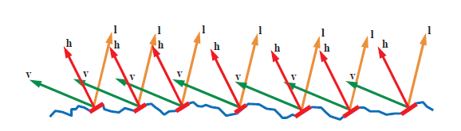

对于specular微表面模型,对于所有$\vec m \neq \vec h$,菲涅尔项为0,

$f_{spec}(\vec l,\vec v)=\frac{F(\vec h,\vec l)G_2(\vec l,\vec v,\vec h)D(\vec h)}{4|\vec n\cdot\vec l||\vec n\cdot\vec v|}$

##### normal distribution functions(D项)

NDF

大多数渲染器用的NDF都是*isotropic*(各向同性),此时,NCF只是一个宏观法线$\vec n$和微表面法线$\vec m$之间的夹角$\theta_m$的函数,理想情况下,可使用$\cos(\theta_m)$简单计算。

Beckmann NDF最早被使用，它也被Cook-Torrance BRDF选用:

$D(\vec m)=\frac{\chi^+(\vec n\cdot\vec m)}{\pi \alpha_b^2(\vec n\cdot m)^4}\exp(\frac{(\vec n\cdot\vec m)^2-1}{\alpha_b^2(\vec n\cdot\vec m)^2})$

其中$\chi^+(\vec n\cdot\vec m)$确保背面贡献为0,另外值得注意的是这里有个$\frac{1}{\pi}$在完整的BRDF中可以被约掉.如所有的NDFs一样，它描述了一个heightfield微表面.$\alpha_b$控制roughness,它与微表面的均方根成正比(RMS),当$\alpha_b=0$时,微表面绝对平滑.

当将Smith $G_2$函数引入Beckmann NDF，需要相应的$\Lambda$函数.Beckmann NDF是shape-invariant(形状不变的),可以简化$\Lambda$函数,这种NDFs形式如下:

$D(\vec m)=\frac {\chi^+(\vec n\cdot \vec m)}{alpha^2(\vec n\cdot\vec m)^4}g(\frac{\sqrt{(1-(\vec n\cdot \vec m)^2)}}{\alpha(\vec n\cdot\vec m)})$

$g$是任意变量函数.对于各向同性的NDF,$\Lambda$依赖于两个变量:其一为roughness $\alpha$;其二为向量($\vec v$ or $\vec l$)的入射角。但对于shape-invariant NDF,$\Lambda$函数只依赖于变量$a$:

$a=\frac{\vec n\cdot\vec s}{\alpha\sqrt{1-(\vec n\cdot\vec s)^2}}$

其中$\vec s$代指$\vec v$或$\vec l$.事实上,仅依赖于一个变量的$\Lambda$实现是合适的.单变量函数更容易你和曲线,能用一维数组表示.

Beckmann NDF的$\Lambda$：$\Lambda(\alpha)=\frac{erf(\alpha)-1}{2}+\frac{1}{2\alpha\sqrt(\pi)}\exp(-\alpha^2)$

其中$erf$为错误处理函数,所以有待评价.作为近似解决:

$\Lambda(\alpha)$=$$\begin{cases}
\frac{1-1.259\alpha+0.396\alpha^2}{3.535\alpha+2.181\alpha^2}, \alpha < 1.6\\
0,\alpha \leq 1.6\\
\end{cases}$$

另一个NDF是Blinn-Phong NDF.是过去常用的,现在移动端常用，该NDF是对Phong shading model的推广.

$D(\vec m)=\chi^+(\vec n\cdot\vec m)\frac{\alpha_p+2}{2\pi}(\vec n\cdot\vec m)^{\alpha_p}$

其中the power $\alpha_p$是Phong NDF中的roughness变量,越大约光滑,[0,$\infty$]

## 9 BRDF Model for Subsurface Scattering

## 10 BRDF Models for Cloth

## 11 Wave Optics BRDF Models

## 12 Layered Materials

## 13 Blending And Filtering Materials

