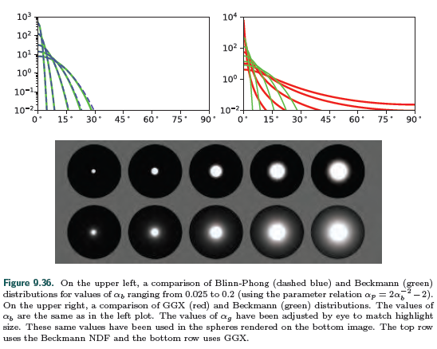
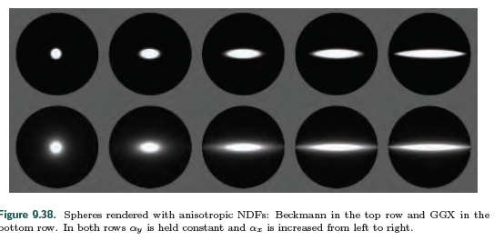
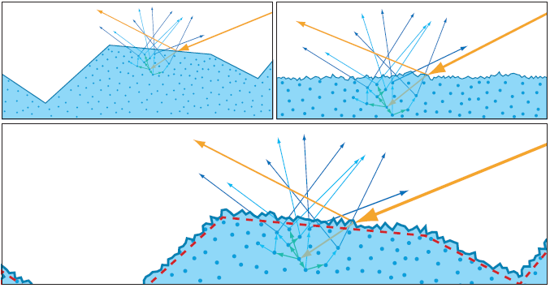
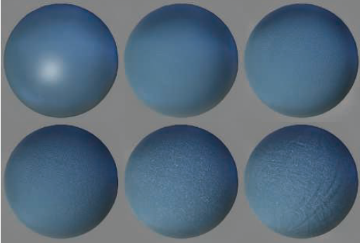
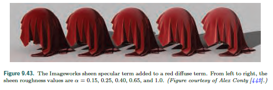
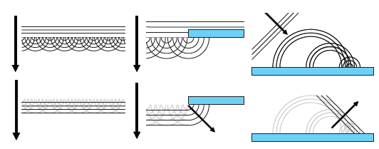
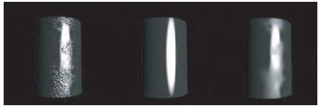
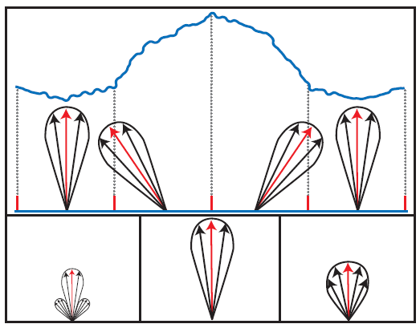

[TOC]

## 1 Physics of Light

### 基本概念

可见光波长400~700 nm

能量

辐射度

### 定义

| 符号        | 定义         | 说明                 |
| ----------- | ------------ | -------------------- |
| $\vec l$    | 光源方向     |                      |
| $\vec v$    | 视线反方向   |                      |
| $\vec p$    | 片元点       |                      |
| $\vec n$    | 法线         |                      |
| $c_{light}$ | 光源的颜色   |                      |
| $\vec l_c$  | 光源原点     |                      |
| $\vec r_i$  | 反射光线     | 与法线夹角$\theta_i$ |
| $\vec m$    | 为表面法线   |                      |
| $\rho_s$    | 表面Albedo   |                      |
| $\rho_{ss}$ | 次表面Albedo |                      |
|             |              |                      |
|             |              |                      |
|             |              |                      |
|             |              |                      |

关键角度

| 符号     | 定义           | 说明 |
| -------- | -------------- | ---- |
| $\theta$ | 光线与法线夹角 |      |
|          |                |      |
|          |                |      |
|          |                |      |

公式相关

| 形式        | 含义                       |
| ----------- | -------------------------- |
| $(x)^{\mp}$ | saturate(x),clamp to [0,1] |
|             |                            |
|             |                            |
|             |                            |
|             |                            |

Azimuth angles $\phi_i$ and  $\phi_0$are given with respect to a given tangent
vector $\vec t$. The relative azimuth angle $\phi$, used for isotropic BRDFs instead of  $\phi_i$ and $\phi_0$, does not require a reference tangent vector.

### Particles

### 介质

IOR n

> 原始波和新波的速度比

让波速减少的介质有衰减系数k(kappa)

### Surface

折射

$\frac{\sin(\theta_t)}{\sin(\theta_i)}=\frac{n_1}{n_2}$

微表面

### Subsurface Scattering

次表面散射

### BRDF

$$L_i(\vec c,-\vec v)=L_0(\vec p,\vec v) $$

> $$\vec c$$ 指camera pos
>
> $$\vec v$$ 指点到摄像机的射线
>
> $$\vec p $$ 指片元点,也就是view ray与surface的焦点(intersection)

## 9.2 Camera

## 9.4 BRDF(bidirectional reflectance distribution function)

$f(\vec l,\vec v)$

S(V)BRDF

#### 考虑折射率方程

$L_0(\vec p,\vec v) = \int_{\vec l \in \Omega}f(\vec l,\vec v)L_i(\vec p,\vec l)(\vec n \cdot \vec l)d\vec l$

$\vec l \in \Omega$ 

对于点$p$,起折射率为

$L_0(\vec v) =\int_{\vec l \in \Omega}f(\vec l,\vec v)L_i(\vec l)(\vec n \cdot \vec l)d\vec l$

在球坐标下，通常用角度$\phi$ 、$\theta$来描述

$d\vec l$ = $\sin(\theta_i)d\theta_id\phi_i$

$\vec n \cdot \vec l$ = $\cos\theta_i$

于是有

$L_0(\theta_0,\phi_0)=\int_{\phi_i=0}^{2\pi}\int_{\theta_i=0}^{\frac{\pi}{2}}f(\theta_i,\phi_i,\theta_0,\phi_0)L(\theta_i,\phi_i)\cos\theta_i\sin\theta_id\theta_id\phi_i$

> $\theta_i$
>
> $\phi_i$
>
> $\theta_0$
>
> $\phi_0$

BRDF只定义了view和light位于surface上方的情况

> 意味着$\vec n\cdot\vec l$需要calmp(0,)
>
> 为了避免除0，通常用abs($\vec n\cdot\vec l$)*0.00001

BRDF原则

>1. 互异性:$f(\vec l,\vec v)=f(\vec v,\vec l)$
>2. 能量守恒:输出能量<=输入能量

#### directional-hemispherical reflectance $R(\vec l)$

描述BRDF能量损失程度，也就是surface的粗糙度roughenss

$R(\vec l)=\int_{\vec v \in \Omega}f(\vec l,\vec v)(\vec n\cdot\vec v)d\vec v$         $\in[0,1]$

放射方程中的$\vec v$、$\vec l$  是整个半球的。。

类似的

$R(\vec v)=\int_{\vec l \in \Omega}f(\vec l,\vec v)(\vec n\cdot\vec v)d\vec l$

#### Lambertian BRDF

最简单的BRDF是Lambertian

其中$\vec n\cdot\vec l$ 项简化了

real-time rending常用

$f(\vec l,\vec v)是一个常数

$R(\vec l)=\pi f(\vec l,\vec v)$

漫反射(constant relfectance) diffuse color $c_{diff}$ 或者albedo $\rho$，次表面subsurface albedo $\rho_ss$

$f(\vec l,\vec v)=\frac{\rho_{ss}}{\pi}$

其中$\frac{1}{\pi}$时由于半球上积分余弦因子产生

 

这里抽象一个模型，假设入射光恒定

输出为:diffuse,specular lobe,

>1上为Lambertian BRDF(简单球形)
>
>2.上为Blinn-Phong highlighting+Lambertian term
>
>3.上为Cook-Torrance BRDF
>
>1.下a close-up of Ward's anisotropic model。tilt the specular lobe
>
>2.下Hapke/Lommel -Seeliger "Lunnar surface " BRDF
>
>3.下Lommel-Seeliger scattering

## 9.5 Illumination

$L_i(\vec l)$ term 描述反射方程在shaded surface point的光

Global illumination(GI)通过光在整个场景的弹射等效果计算$L_i(\vec l)$,这种策略将反射考虑进来了。

这一节，描述的时local illumination，也就是假设一直$L_i(\vec l)$，计算每个点使用GI时该如何计算光照。

真实场景,$L_i(\vec l)$计算了所有方向的来自光源或表面反射的非0辐射,真实世界的光为area lights。本节讨论的时虚拟的方向光或精确坐标的光源

将方向光的影响极限趋近为0时，可以积分方程可以简化为单个计算更少的BRDF方程

$L_0(\vec v)=\pi f(\vec l_c,\vec v)c_{light}(\vec n\cdot\vec l_c)$

为了确保背面的光不被计算进来，$(\vec n,\vec l)$需要clamped to 0

$L_0(\vec v)=\pi f(\vec l_c,\vec v)c_{light}(\vec n\cdot\vec l_c)^+$

对于n个光源

$L_0(\vec v)=\pi \sum_{i=1}^n f(\vec l_{c_i},\vec v)c_{light_i}(\vec n \cdot \vec l_{c_i})^+$

其中$\vec l_{c_i}$为光源方向,$c_{light_i}$为光源颜色

其中$\pi$因子被BRDFs中出现的$\frac{1}{\pi}$抵消，但公式、论文中不能简化。

## 9.6 Fresnel Reflectance

物体的表面由其周围的介质和substance组成。光源在两个介质间相互作用遵守Fresnel equations(*Augustin-Jean Fresnel*).

菲涅尔对surface有几何假设:表面不含有光波波长的1~100倍的不规则

光与与表面作用后分成两部分：反射、折射

反射光用$\vec r_i$表示，它与$\vec n$夹角为$\vec \theta_i$,根据入射光线$\vec l$和$\vec n$可以计算的到

$\vec r_i = 2(\vec n\cdot \vec l)\vec n - \vec l$

反射的量由*Fresnel reflectance* F描述,该变量由$\theta_i$决定

$F(\theta_i)$ 当做RGB处理，规则

> * 当$\theta_i = 0^o$,也就是光线垂直入射时，有$F_0$,也被认为是该物质的镜面反射颜色，也叫垂直入射
> * 随着$\theta_i$上升，$F(\theta_i)$也上升，当$\theta_i = 90^o$,$F(\theta_i) = 1$ (白色)
> * 上升的曲线由物质决定，

上图依次为:玻璃、铜、铝的Fresnel reflectance.可以看到，不同波长的光的曲线不同，不同物质相同波长的曲线不同。波长由可以找到对应光颜色，也就是不同颜色的光的反射结果不同。玻璃这种物质的F与光颜色无光。

我们使用$F(\vec n,\vec l)$而不用$\theta_i$,Fresnel function时BRDF的一部分。

$F_0$由物质决定，在rough工作流，常简化

$F$项计算方法(Schlick):

$F(\vec n,\vec l)\approx F_0+(1-F_0)(1-(\vec n\cdot\vec l)^+)^5$

这个公式时白色和$F_0$的非线性差值结果。

另一种计算的方案(Gulbrandsen),不能用来实时计算。这个曲线更拟合金属的Fresnel equations。

对于Schlick,$F_0$只是一个参数，下面的方程介绍了如何通过两种介质的折射率计算$F_0$,这里用n代替了$n_2$,这里$n_1=1$(空气环境下)

$F_0={(\frac{n-1}{n+1})}^2$

该值转化为RGB颜色的公式在8.1.3介绍颜色空间时提及

软件中常用公式为

$F(\vec n,\vec l) \approx F_0 + (F_{90} - F_0)(1-(\vec n\cdot\vec l)^+)^{\frac{1}{p}}$

设置$F_{90}$为非白色可以描述Fresnel 方程无法描述的物质，比如覆盖物质上的灰尘

##### 常见物质的$F_0$

主要分三类：绝缘体(insulators),半导体(semiconductor),导体(conductor)

Dielectrics 的$F_0$很低，通常<=0.06,菲涅尔效果明显

对于未知物质通常使用0.04

| Dielectric      | Linear      | Texture(sRGB) | Color | Notes                                                        |
| --------------- | ----------- | ------------- | ----- | ------------------------------------------------------------ |
| Water           | 0.02        | 39            |       |                                                              |
| Living tissue   | 0.02-0.04   | 39-56         |       | Watery tissues are toward the lower bound, dry ones are higher |
| Skin            | 0.028       | 47            |       |                                                              |
| Eyes            | 0.025       | 44            |       | Dry cornea (tears have a similar value to water)         |
| Hair            | 0.046       | 61            |       |                                                              |
| Teeth           | 0.058       | 68            |       |                                                              |
| Fabric          | 0.04-0.056  | 53-67         |       | Polyester highest, most others under 0.05                    |
| Stone           | 0.035-0.056 | 53-67         |       | Values for the minerals most often found in stone            |
| Plastics, glass | 0.04-0.05   | 56-63         |       | Not including crystal glass                                  |
| Crystal glass   | 0.05-0.07   | 63-75         |       |                                                              |
| Gems            | 0.05-0.08   | 63-80         |       | Not including diamonds and diamond simulants                 |
| Diamond-like    | 0.13-0.2    | 101-124       |       | Diamonds and diamond simulants(e.g., cubic zirconia, moissanite) |

##### 金属的菲涅尔反射

金属的$F_0$很大，通常高于0.5

##### 半导体的菲涅尔反射

介于导体和绝缘体之间，范围为[0.2,0.45]

##### 水的菲涅尔反射

之前讨论的菲涅尔反射全是基于空气的，真空或者液体环境下值是不一样的，也就是不能假设$n_1 = 1$了，此时我们需要使用如下公式计算$F_0$

$F_0=(\frac{n_1-n_2}{n_1+n_2})^2$

通常$n_1\not= 1$是水下场景。也有可能是其他情况，比如雾

##### 参数化Fresnel Values

常用的参数化时将$F_0$和diffuse color $\rho_{ss}$合并，这种方法能是的金属这类无diffuse color和电解质具有一组受限的$F_0$.它包含一个RGB颜色$C_{surf}$和一个标量*m*--metallic/metalness

> * 如果$m=1$,$F_0$为$c_{surf}$,$\rho_{ss}是black;
> * 如果$m=0$,$F_0$为电解质值(是一个常量(0.04)或被额外参数控制的值),$c_{surff} = \rho_{ss}$

"metalness"最早被Brown University使用，电影$Wall-E​$.迪士尼动画电影$Wreck-It​$中的$Disney principled​$光照模型中使用了一个额外的变量"specular"来控制$F_0​$,这个参数化方法被Unreal Engine和Frostbite engine使用来描述非电解质的范围较广的$F_0​$.游戏$Call of Duty:Infinite Warfare​$使用压缩算法将两个值压缩为一个值，节省内存。$Overwatch​$也是用了一种压缩算法：

mixed.rg为图片使用通道

$$metallic = saturate(2*mixed.r-1)^2;$$

$$diffuse = albedo.rgb*(1-metallic);$$

$$F_0=saturate(mixed.r-0.25)$$

$$F_0=F_0*0.06+0.02$$

$$specular=lerp(F_0,albedo,metallic)$$

$$onemiusref=(1-metallic)*(1-F_0)$$

多数实时渲染引擎使用metalness值而不直接使用$F_0$和$\rho_{ss}$是出于使用方便和节省G-buffer.在游戏*Call of Duty: Infinite Warfare*中，美术绘制$F_0$和$\rho_{ss}$的纹理，再通过压缩算法存储到一个同道中。

metalness工作流有几个缺点:它不能描述有些种类的材质，比如具有着色$F_0$的电镀金属。美术可以手动调整得到中间值。

另一个被实时渲染引擎使用的参数化技巧:除了特种抗折射涂层，没有一个材质的$F_0$时小于0.02的。这个技巧用来高亮边缘。这里没有使用额外的occ纹理，而是将小于0.02部分用来“关闭”菲涅尔边缘增强。这项技术被Schuler发明，用于UE和Frostbite engiens.

##### Internal Reflection

次表面反射

当$n_1>n_2$会发生次表面反射

次表面只有绝缘体会有，

$\sin_{\theta_c}=\frac{n_2}{n_1}=\frac{1-\sqrt F_0}{1+\sqrt F_0}$

##### Microgeometry

关于法线

## 9.7 Microfacet Theory

微表面理论

micro-BRDF $f_u(\vec l,\vec v,\vec m) $ 混合了所有微表面的反射光

左侧，我们看到积分项$D(\vec m)(\vec n\cdot \vec m)$,

右侧，积分项$D(\vec m)(\vec v\cdot \vec m)$，$\cos(\theta_o)=(\vec v\cdot\vec n)$

称为*normal distribution function * or NDF,使用符号$D(\vec m)$表示,也称为D项,微表面法线的贡献，更有用的时积分$D(\vec m)(\vec n\cdot\vec m)$,$\Theta$表示对以$\vec n$为中心的整个球面积分

$\int_{m\in \Theta}D(\vec m)(\vec n\cdot\vec m)d\vec m = 1$

如果对以$\vec n$为中心的半球进行积分使用符号$\Omega$表示

在经验表明,heightfields,所有位于$\Omega$外的$\vec m$的$D(\vec m)=0$,但non-heightfields它是合法的

更通用的,从任何视线方向，微表面在视线垂直方向的投影都满足如下公式

$\int_{m\in\Theta}D(\vec m)(\vec v\cdot\vec m)d\vec m=\vec v\cdot\vec n$

注意$\cdot$没有clamp(0,1),右侧展示了原因.

渲染时,我们只考虑可见的微表面，可见微表面的投影面积之和等于宏观表面投影面积，这里提出新的一项G项,masking function $G_1(\vec m,\vec v)$来描述微表面的法线$\vec m$和视线$\vec v$的可见性，此时积分项为球面的$G_1(\vec m,\vec v)D(\vec m)(\vec v\cdot\vec m)^+$：

$\int_\Theta G_1(\vec m,\vec v)D(\vec m)(\vec v\cdot\vec m)^+d\vec m=\vec v\cdot\vec m$

$G_1(\vec m,\vec v)D(\vec m)$时可见的*normals*的贡献，

Smith $G_1$ function:

$G_1(\vec m,\vec v)=\frac{\chi^+(\vec m)\cdot\vec v}{1+\Lambda(\vec v)}$

$$\chi^+(x)= $$$
\left \{ 
\begin{array}{c}
1,where x < 0\\ 
0,where x \leq 0
\end{array}
\right. 
$

$\Lambda$函数对每个NDF都不同,Smith masking目前是最好的一个G项函数，但并不是完美的，也就是还有更好的解决策略，但目前渲染器都用的它。

考虑了微表面法线的贡献后的micro-BRDF $f_\mu(\vec l,\vec v,\vec m)$,normal贡献$D(\vec m)$,mask函数$G_1(\vec m,\vec v)$后新的微表面BRDF为:

$$f(\vec l,\vec v)=\int_{m\in\Omega}f_\mu(\vec l,\vec v,\vec m)G_2(\vec l,\vec v,\vec m)D(\vec m)\frac{(\vec m\cdot\vec l)^+}{|\vec n\cdot \vec l|}\frac{(\vec m\cdot\vec v)^+}{|\vec n\cdot\vec v|}d\vec m$$

这里是对半球积分

这里使用*joint masking-shadowing function* $G_2(\vec l,\vec v,\vec m)$而不是用$G_1(\vec m,\vec v)$,该方程式$G_1$的扩展，给出了根据从view vector $\vec v$和light vector $\vec l$可见的normal $\vec m$的微表面微分。使得BRDF能够masking,也能shadowing.和所有BRDFs一样，都有一个太暗的缺点。

Heitz讨论了一些$G_2$的方程，最简单的是$G_2(\vec l,\vec v,\vec m)=G_1(\vec v,\vec m)G_1(\vec l,\vec m)$,这里假设masking和shadowing是无关联的。事实上，不是。这会导致过暗。当光线和视线方向一致时，应该有$G_1$=$G_2$，但是该方法仍然是$G_2=G_1^2$,假定$\phi$为$\vec v ,\vec l$之间的角度，$G_2(\vec l,\vec v,\vec m)$=$\min(G_1(\vec v,\vec m),G_1(\vec l,\vec m))$,这种条件下，对任何$G_1$有:

$G_2(\vec l,\vec v,\vec m)=\lambda(\phi)G_1(\vec v,\vec m)G_1(\vec l,\vec m)+(1-\lambda(\phi))\min(G_1(\vec v,\vec m),G_1(\vec l,\vec m))$
其中$\lambda(\phi)=1-e^{-7.3\phi^2} \in [0,1] \propto \phi$

另一个$\lambda$函数$\lambda(\phi)=\frac{4.41\phi}{4.41\phi+1}$

考虑光线和视线的相关性,*Smith height-correlated masking-shadowing function*:

$G_2(\vec l,\vec v,\vec m)=\frac{\chi^+(\vec m\cdot\vec v)\chi^+(\vec m\cdot\vec l)}{1+\Lambda(\vec v)+\Lambda(\vec l)}$

Heitz也提出了一个混合direction和height的相关性的函数:

$G_2(\vec l,\vec v,\vec m)=\frac{\chi^+(\vec m\cdot\vec v)\chi^+(\vec m\cdot\vec l)}{1+max(\Lambda(\vec v),\Lambda(\vec l))+\lambda(\vec v,\vec l)\min(\Lambda(\vec v),\Lambda(\vec l))}$

## 9.8 BRDF Models for Surface Reflection

##### specular term

这里假设微表面perfectly mooth fresnel mirror。这意味着,除非$\vec l$平行于$\vec v$，$f_\mu(\vec l,\vec v,\vec m) == 0$

新增变量*half vector *$\vec h = \frac{\vec l+\vec v}{||\vec l+\vec v||}$

对于specular微表面模型,对于所有$\vec m \neq \vec h$,菲涅尔项为0,

$f_{spec}(\vec l,\vec v)=\frac{F(\vec h,\vec l)G_2(\vec l,\vec v,\vec h)D(\vec h)}{4|\vec n\cdot\vec l||\vec n\cdot\vec v|}$

##### normal distribution functions(D项)

NDF

大多数渲染器用的NDF都是*isotropic*(各向同性),此时,NCF只是一个宏观法线$\vec n$和微表面法线$\vec m$之间的夹角$\theta_m$的函数,理想情况下,可使用$\cos(\theta_m)$简单计算。

Beckmann NDF最早被使用，它也被Cook-Torrance BRDF选用:

$D(\vec m)=\frac{\chi^+(\vec n\cdot\vec m)}{\pi \alpha_b^2(\vec n\cdot m)^4}\exp(\frac{(\vec n\cdot\vec m)^2-1}{\alpha_b^2(\vec n\cdot\vec m)^2})$

其中$\chi^+(\vec n\cdot\vec m)$确保背面贡献为0,另外值得注意的是这里有个$\frac{1}{\pi}$在完整的BRDF中可以被约掉.如所有的NDFs一样，它描述了一个heightfield微表面.$\alpha_b$控制roughness,它与微表面的均方根成正比(RMS),当$\alpha_b=0$时,微表面绝对平滑.

当将Smith $G_2$函数引入Beckmann NDF，需要相应的$\Lambda$函数.Beckmann NDF是shape-invariant(形状不变的),可以简化$\Lambda$函数,这种NDFs形式如下:

$D(\vec m)=\frac {\chi^+(\vec n\cdot \vec m)}{\alpha^2(\vec n\cdot\vec m)^4}g(\frac{\sqrt{(1-(\vec n\cdot \vec m)^2)}}{\alpha(\vec n\cdot\vec m)})$

$g$是任意变量函数.对于各向同性的NDF,$\Lambda$依赖于两个变量:其一为roughness $\alpha$;其二为向量($\vec v$ or $\vec l$)的入射角。但对于shape-invariant NDF,$\Lambda$函数只依赖于变量$a$:

$a=\frac{\vec n\cdot\vec s}{\alpha\sqrt{1-(\vec n\cdot\vec s)^2}}$

其中$\vec s$代指$\vec v$或$\vec l$.事实上,仅依赖于一个变量的$\Lambda$实现是合适的.单变量函数更容易你和曲线,能用一维数组表示.

Beckmann NDF的$\Lambda$：$\Lambda(\alpha)=\frac{erf(\alpha)-1}{2}+\frac{1}{2\alpha\sqrt(\pi)}\exp(-\alpha^2)$

其中$erf$为错误处理函数,所以有待评价.作为近似解决:

$\Lambda(\alpha)$=$$\begin{cases}
\frac{1-1.259\alpha+0.396\alpha^2}{3.535\alpha+2.181\alpha^2}, \alpha < 1.6\\
0,\alpha \leq 1.6\\
\end{cases}$$

另一个NDF是Blinn-Phong NDF.是过去常用的,现在移动端常用，该NDF是对Phong shading model的推广.

$D(\vec m)=\chi^+(\vec n\cdot\vec m)\frac{\alpha_p+2}{2\pi}(\vec n\cdot\vec m)^{\alpha_p}$

其中the power $\alpha_p$是Phong NDF中的roughness变量,越大约光滑,[0,$\infty$],$\alpha_p$是一个非线性映射函数，比如$\alpha_p=m^s$，其中m根据需要预设，比如8192，$s\in[0,1]$.这种映射在非感觉一致的BRDF中有用。

$\alpha_p=2\alpha_b^{-2}-2$为Beckmann 何Blinn-Phong的roughness参数等效值.Blinn-Phong NDF不是形状无关的.

GGX项

$D(\vec m)=\frac{\chi^+(\vec n\cdot\vec m)\alpha_g^2}{\pi(1+(\vec n\cdot\vec m)^2(\alpha_g^2-1))^2}$

$\alpha_g$控制roughness,与Beckmann $\alpha_b$类似

在Disney principled shading model中,Burley使用$\alpha_g=r^2$控制roughness,其中r是[0,1]的rouhenss.这种映射方式被i大多数软件使用。

GGX（红,下)与Beckmann(绿,上)对比

GGX是形状无关的,它的$\Lambda$函数为$\Lambda(a)=\frac{-1+\sqrt{1+\frac{1}{a^2}}}{2}$

$a$作为$a^2$存在减少平方开根次数.

GGX和Smith masking-shadowing函数都很流行,这有个合并二者的函数。Lagarde观察到,GGX的高度相关的$Smith G_2$有抵消的项。合并后为:

$\frac{G_2(\vec l,\vec v)}{4|\vec n\cdot\vec l||\vec n\cdot\vec v|}\Rightarrow\frac{0.5}{\mu_0\sqrt{\alpha^2+\mu_i(\mu_i-\alpha^2\mu_i)}+\mu_i\sqrt{\alpha^2+\mu_0(\mu_0-\alpha^2\mu_0)}}$

简化方程:$\mu_i=(\vec n\cdot\vec l)^+$,$\mu_0=(\vec n\cdot\vec v)^+$.

这里提到了一个叫MERL database的东西.

Karis得到一个GGX的Smith $G_1$的近似方程:$G_1(\vec s )=\frac{2(\vec n\cdot \vec s)}{(\vec n\cdot \vec s)(2-\alpha)+\alpha}$

其中$\vec s$可以被$\vec l  $or$ \vec v$代替.

Hammon提出了一个混合了高度矫正的Smith $G_2$函数和specular microfacet BRDF的$G_1$

$\frac{G_2(\vec l,\vec v)}{4|\vec n\cdot\vec l||\vec n\cdot\vec v|}\approx \frac{0.5}{lerp{(2|\vec n\cdot \vec l|\vec n\cdot\vec v|,|\vec n\cdot\vec l|+|\vec n\cdot \vec v|,\alpha)}}$

其中$lerp(x,y,s)=x(1-s)+ys$

比较GGX和Beckmann:GGX峰值更狭窄、尾更长.真实世界的高光的tails比GGX还长.在得到更好的方程前,GGX仍然会流行.

$\color{Red}GTR$

Burley处于更多的控制NDF的形状、明确控制其tails,提出了*generalized Trowbridge-Reitz(GTR) NDF*:

$D(\vec m)=\frac{k(\alpha,\gamma)}{\pi(1+(\vec n\cdot\vec m)^2(\alpha_g^2-1))^{\gamma}}$

其中$\gamma$控制tail的形状,当$\gamma=2$,GTR就与GGX一样.随着$\gamma$减少，tails会更长，随着$\gamma$增大,tails会变短,值足够大时,GTR就与Beckmann一样.其中$k(\alpha,\gamma)$项是归一化因子:

$k(\alpha,\gamma)$=$
\left \{ 
\begin{array}{c}
\frac{(\gamma-1)(\alpha^2-1)}{(1-(alpha^2)^{(1-\gamma)})},\gamma\neq1 \and \alpha \neq 1\\ 
{\frac{\alpha^2-1}{\ln(\alpha^2)},\gamma = 1\and\alpha\neq 1}\\{1,\alpha=1}
\end{array}
\right. 
$

GTR不是形状不变的,这让它的Smith $G_2$ masking-shadowing函数的寻找变得复杂.该NDF发布3年后才找到其$G_2$函数,该函数非常复杂,另一个问题是GTR的参数$\alpha$和$\gamma$以非直觉的方式感知roughenss和发光.

*Student's t-distribution(STD)*和*exponential power distribution(EPD)* NDFs包括形状控制参数,作为GTR的对比，这些函数形状无关,只关心roughness变量.

一个可行的能更好的匹配测量的材质的方法是使用*multiple   specular   lobes*，而不是提升NDF的复杂度.这个想法来自*Cook*和*Torrance*,经过Ngan测试,对许多材质，增加第二个lobe确能提高效果。Pixar's PxrSurface材质有一个"roughspecular"lobe用于这个目的。额外的lobe是一个完整的specular微表面BRDF，混合了两个GGX NDFs，这里使用额外的NDF而不是一个完整的specular BRDF项.这种情况下，只需要额外的roughness和一个混合参数.

##### Anisotropic Normal Distribution Functions(各向异性函数)

这节讨论为各向异性材质渲染用到的BRDFs，尤其是其NDFs.

与各向同性NDFs不同,各向异性NDFs只有一个角度$\theta_m$已经不够了，还需要额外的信息.通常微表面法线$\vec m$需要变化到local frame或者通过normal、tangent、bitangent定义的tangent spece中,这种变化通过三个点乘表式:$\vec m\cdot\vec n$,$\vec m\cdot\vec t$,$\vec m\cdot\vec b$

当给各项同性BRDFs混合normal mapping时，确保normal map扰动tangent、bitangent、normal很重要,这个过程通常在*modified Gram-Schmidt*过程中处理.下面公式假设normal已经归一化.

$\vec t'=\vec t_0-(\vec t_0\cdot\vec n) \Rightarrow \vec t = \frac{\vec t'}{||\vec t'||}$

由

$\vec b'=\vec b_0-(\vec b_0\cdot\vec n)\vec n$

$\vec b''=\vec b'-(\vec b'\cdot\vec t)\vec t$

有$\vec b=\frac{\vec b''}{||\vec b''||}$

再有第一个公式和$\vec n$可以直接得到$\vec b= {\vec n}\times{\vec t}$.

对于特殊材质比如腐蚀、头发，tangent direction需要逐像素modification,通常由tangent map提供.与normal map类似,这张纹理著像素存储了tangent值,tangent纹理通常只存储垂直于法线的平面的二维分量.这种方法方便采用类似normal map的压缩方法，有的软件直接存储了一个scalar值(绕着normal旋转)--但这种方法在从360到0度旋转时会产生伪影.

一种各向异性NDF的近似方法是推广各向同性的NDF,这种近似方法能用所有形状无关的各向同性的NDF,这也是为什么形状无关的NDFs更好.回顾形状无关的各项同性的NDFs形式:

$D(\vec m)=\frac {\chi^+(\vec n\cdot \vec m)}{\alpha^2(\vec n\cdot\vec m)^4}g(\frac{\sqrt{(1-(\vec n\cdot \vec m)^2)}}{\alpha(\vec n\cdot\vec m)})$

$g$表示描述NDF的形状的一维函数,此时各向异常的版本为:

$D(\vec m)=\frac {\chi^+(\vec n\cdot \vec m)}{\alpha_x\alpha_y(\vec n\cdot\vec m)^4}g(\frac{\sqrt{(\frac{{(\vec t\cdot\vec m)}^2}{\alpha_x^2}-\frac{(\vec b\cdot \vec m)^2}{\alpha_y^2})}}{(\vec n\cdot\vec m)})$

$\alpha_x$和$\alpha_y$分别表示$\vec t$和$\vec b$方向的roughness,特殊的当$\alpha_x==\alpha_y$,就是各项同性的形式.

​	除了变量a($\Lambda$函数传入)计算不同,各向异性的NDF的$G_2$masking-shadowing函数与各向同性一致,其中$\vec s$表示$\vec v$或$\vec l$:

$a=\frac{\vec n\cdot\vec s}{\sqrt{\alpha_x^2{(\vec t\cdot\vec s)}^2+\alpha_y^2{(\vec b\cdot\vec s)}^2}}$

​	这种方式下,各项异性的Beckmann 扩展的NDF为:

​	$D(\vec m)=\frac{\chi^+(\vec n\cdot\vec m)}{\pi\alpha_x\alpha_y(\vec n\cdot\vec m)^4}\exp{(-\frac{{\frac{{(\vec t\cdot\vec m)}^2}{\alpha_x^2}}{}+\frac{(\vec b\cdot\vec m)^2}{\alpha_y^2}}{{(\vec n\cdot\vec m)}^2})}$

​	各向异性的GGX NDF:

​	$D(\vec m)=\frac{\chi^+(\vec n\cdot\vec m)}{\pi\alpha_x\alpha_y({\frac{(\vec t\cdot\vec m)^2}{\alpha_x^2} + \frac{(\vec b\cdot\vec m)^2}{\alpha_y^2} + (\vec n\cdot\vec m)^2})^2}$

​	然而最直接的方式是参数化各向异性NDFs,使用两次各向同性参数roughness,一次给$\alpha_x$,一次给$\alpha_y$,其他参数也又是也这样.在Disney pricipled shading model中,各向同性roughness 参数$r$会与第二个scalar参数$k_{aniso}\in[0,1]$混合,而$\alpha_x$与$\alpha_y$通过他们求得(0.9因子限制预期值范围为[10,1]):

​	$k_{aspect}=\sqrt{(1-0.9k_{aniso})},$

​	$\alpha_x=\frac{r^2}{k_{aspect}},$

​	$\alpha_y=r^2k_{aspect}.$

​	Imageworkds使用不同的参数化公式，允许任意程度的各向异性:

​	$\alpha_x=r^2(1+k_{aniso}),\\\alpha_y=r^2(1-k_{aniso}).$

##### Multiple-Bounce Surface Reflection

​	之前提到微表面BRDF框架没有考虑微表面的多次弹射的反射,造成了一些额外的能力损失,表现为偏黑--尤其是一些粗糙金属材质.

​	Imageworkds在之前的工作基础上增加了新的可以与BRDF相加的项来模拟多次弹射的反射:

$f_{ms}(\vec l,\vec v)=\frac{\overline {F}  \overline {R_{sF_1}}}{\pi(1-\overline {R_{sF_1}})(1-\overline{F}(1-\overline {R_{sF_1}}))}(1-R_{sF_1(\vec l)}{(1-R_{sF_1}(\vec v))})​$

其中,$R_{sF_1}$是specular BRDF项在$F_0$为1时的$f_{sF_1}$的方向反射率,$R_{sF_1}$依赖于roughenss $\alpha$和$\theta$.它能通过$\color{Red}预计算$存储在二维纹理中.Imageworks发现32x32的纹理就够了.$\overline R_{sF_1}$是$R_{sF_1}$在半球上的余弦加权(cosine-weighted).它只依赖于$\alpha$,所以能存储在一维纹理或用一条拟合曲线表示.$R_{sF_1}$是绕着$\vec n$旋转的对称的值.

​	$\mu = \cos \theta$,

​	$\overline {R_{sF_1}}=\frac {\int_{\vec s\in\Omega}{R_{sF_1}(\vec s)(\vec n\cdot\vec s)d\vec s}}{\int_{\vec s\in\Omega}{(\vec n\cdot\vec s)d\vec s}}=\frac{1}{\pi}\int_{\Phi=0}^{2\pi}{\int_{\mu=0}^{1}{R_{sF_1}(\mu)\mu d \mu d\Phi}}$=$2\int_{\mu=0}^{1}{R_{sF_1}(\mu)\mu d \mu}$

​	$\overline {F}$是Fresnel项的余弦加权结果:$\overline  {F}=2\int_{\mu=0}^1{F(\mu)\mu d \mu}$

​	Imageworkds提出了使用了Schlick的与上面类似的公式:$\overline {F}=\frac{2p^2F_{90}+(3p+1)F_0}{2p^2+3p+1}$

​	如果使用原始的Schlick近似值,上述公式可以简化为:$\overline {F}=\frac{20}{21}F_0+\frac{1}{21}$,在各向异性的情况下,Imageworkds使用从$\alpha_x$到$\alpha_y$之间的roughenss计算$f_{ms}$

## 9.9 BRDF Model for Subsurface Scattering(次表面散射)

​	本章讨论此表面散射或非透明电解质的多个表面弹射.半透或全球面散射的电解质材质在后续会讨论(14章).本章先讨论diffuse模型的diffuse属性在现实中的值,接着讨论表面的roughness在diffuse shading模型中的作用,以及针对选定材料选择smooth-surface或rough-surface shading模型的标准.最后专注这两个模型本身进行讨论.

### 9.9.1 Subsurface Albedo

​	次表面的albedo $\rho_{ss}\in[0,1]$是光入射到非半透电解质表面的能逃逸能量和吸收能量的比值($\rho_{ss}==0$表示全被吸收),$\rho_{ss}$受光波长影响,渲染时$\rho_{ss}$模型化为一个RGB值,与Fresnel $F_0$影响specular color类似,$\rho_{ss}$影响diffuse color.

​	次表面的albedo $\rho_{ss}$比specular color $F_0$更明亮也更重要,因为电解质传输多数为入射光而不是反射光.$\rho_{ss}$与$F_0$有不同的广布分布(导致RGB颜色不同)，因为它来自不同的物理过程(吸收而不是反射).举例:嵌入半透颗粒的彩色塑料,镜面反射不会着色,但漫反射光被颗粒吸收时会被着色--比如一个红色塑料球有白色高光.

​	这有一个误解--$\rho_{ss}$绝不会小于0.015-0.03(30-50 in 8-bit sRGB)--即使是反射良好的材质.但这个限制是基于surface(specular)和次表面(diffuse) reflectance测量的,所以太高了.事实上,材质能有更低的值,比如“OSHA Black"的Y为0.35(超过100),给定的测量和表面高光,$\rho_{ss}$大概为）。0.0035(11in sRGB).

​	当根据真实表面获取$\rho_{ss}$的值时,可以通过控制光照或使用偏振滤波器分离镜面反射.反射光谱比发射光谱更严格,对任何波长都不能超过1,通常都很smooth，是的$\rho_{ss}$的RGB值失效,即使相对较小的sRGB色域也包含范围之外的颜色,需要小心设置$\rho_{ss}$，避免不自然的明亮的颜色，在预计算GI中还可能导致二次反射过亮.

### 9.9.2 Scale of Subsurface Scattering and Roughness

​	次表面散射和粗糙度.一些BRDF模型(典型的diffuse micro-BRDF $f_\mu$)为局部此表面散射使用roughness,但决定因素不是表面多粗糙,而是微表面的不规则度和此表面散射的距离的相对大小.

​	当微表面不规则度(irregularities)比次表面散射距离大时,然后次表面散射会表现出与微观几何相关的影响，如反射,此时应该使用roughness-surface diffuse model.这种models基于微表面理论，将次表面散射看作是微表面的局部作用,只影响micro-BRDF $f_{\mu}$.

​	当次表面散射距离比微表面不规则度大时,此时应该考虑次表面模型不会出现反射现象,此表面散射不是微表面的local行为,此时使用smooth-surface diffuse model.

​	中间情况,当微表面roughness有的比散射距离大、有的小的时候,roughness-surface diffuse model可以适用.effective surface是指不规则度大于次表面散射距离的部分.diffuse 和specular 反射在微表面理论中有不同的roughness值,specular 项使用the actual surface的roughness,diffuse项使用一个更小的值--以来与effective surface.

​	观测距离也有作用,它决定了"微表面"的定义,比如月球,因为其明显的反射现象,通常使用rough-surface diffuse model.但当从地球看时,”微表面“定义的范围要大得多,不奇怪能看到反射现象.

​	

这三个表面有相同的NDFs,但微表面不规则度和次表面散射的距离相对大小不同,左上,此次表面散射距离小于微表面不规则度;右上,反之,下面,展示了微表面有多个roughenss值,红色虚线表示仅包含较大微观结构的有效表面,比次表面散射距离远.

### 9.9.3 Smooth-Surface Subsurface Models

​	smooth-surface微表面模型,也就是讨论微表面的不规则度比次表面散射距离小的材质模型.这类材质的Diffuse Shading不被表面的roughness直接影响.如果diffuse和specular项耦合,roughness会间接影响diffuse shading.

​	在某些实时渲染应用中,此表面散射模型有一个Lambertian 项,但它不能解释光在表面的反射,不适用次表面散射.这类BRDF diffuse term为:

​	$f_{diff}(\vec l,\vec v)=\frac{\rho_{ss}}{\pi}$

​	为了提升这个模型,在微表面(specular)和次表面(diffuse)反射间需要增加一个能量trade-off(平衡、交换),菲涅尔效应意味着随着如何光的角度$\theta$变化表面-次表面能进行量交换,入射角增大,diffuse反射随着specular反射增大而增大,一个基本的考虑平衡的方法是:diffuse乘以1-specular项的Fresnel部分.如果specular项是一个平面镜的一部分,diffuse term为:

​	$f_{diff}(\vec l,\vec v)=(1-F(\vec n,\vec l))\frac{\rho_{ss}}{\pi}$

​	如果specular项是微表面BRDF的一部分,diffuse term为:

​	$f_{diff}(\vec l,\vec v)=(1-F(\vec h,\vec l))\frac{\rho_{ss}}{\pi}$

​	上述两式输出结果为均匀分布,因为输出结果不依赖于$\vec v$,这是有意义的,因为光在发射前会经历多次散射，所以它的出射光会是随机的.但这有两个理由证明它的出射光不是完全均匀的,首先diffuse BRDF项随入射方向变化,根据Helmholtz reciprocity必定也随着出射方向变化;其二光线出射时必定经历折射,这意味着出射光会偏向些方向上.Shirley等人提出了一个在同时支持能量守恒和亥姆霍兹互易性的情况下，处理表面菲涅耳效应和表面-次表面散射平衡的耦合扩散项,该推导假设Schlick近似法用于菲涅耳折射率：

​	$f_{diff}(\vec l,\vec v)=\frac{21}{20\pi}(1-F_0)\rho_{ss}(1-(1-(\vec n\cdot\vec l)^+)^5)(1-(1-(\vec n\cdot\vec v)^+)^5)$

​	上式仅适用于完美菲涅尔镜.Ashikhmin和Shirley提出(Kelemen合Szirmay-Kalos进一步完善)了一个通用的可用于计算与任何镜面反射能量互换、扩散的diffuse项和specular项的公式:

​	$f_{diff}(\vec l,\vec v)=\rho_{ss}\frac{(1-R_{spec(\vec l)})(1-R_{spec(\vec v)})}{\pi(1-\overline  {R_{spec}})}$

​	其中$R_{spec}$是specular项的directional albedo，$\overline {R_{spec}}$是它的球面上的加权平均值,$R_{spec}$能被后文介绍的两个公式计算并且能存储到一个lut里(折射率为第三轴),$\overline {R_{spec}}$与前文$\overline {R_{sF_1}}$用相同的方式计算.与前文介绍的不同指出在于我们不适用$R_{sF_1}$而用$R_{spec}$--包含Fresnel和多次弹射的specular项$f_{ms}$的full specular BRDF项的directional albedo,这提升了$R_{spec}$的lut的维数--不仅依赖于roughness $\alpha$和,仰角$\theta$还以来于Fresnel 反射率.Imageworkds的Kelemen-Szirmay-Kalos的实现中结合diffuse term 他们用了三维的lut--折射率为第三轴,式的$R_{spec}$比$R_{sF_1}$更平滑,且16x16x16就足够了.

​	如果BRDF使用Schlick Fresnel近似且不包含多次弹射的specular项,$F_0$能从积分中分解出来,这样做能让$_{spec}$的lut变成二维.

​	..一些论文介绍..352,353

### 9.9.4 Rough-Surface Subsurface Models

​	Burley将包含了roughness效果和匹配了测量材料的diffuse BRDF 项作为Disney principled shading 模型的一部:

​	$f_{diff(\vec l,\vec v)}=\chi^+(\vec n\cdot\vec l)\chi^+(\vec n\cdot\vec v)\frac {\rho_{ss}}{\pi}((1-k_{ss})f_d)+1.25k_{ss}f_{ss})$

​	其中:

​	$f_d=(1+(F_{D90}-1)(1-\vec n\cdot\vec l)^5)(1+(F_{D90-1})(1-\vec n\cdot\vec v)^5),$

​	$F_{D90}=0.5+2\sqrt{\alpha}(\vec h\cdot\vec l)^2,$

​	$f_{ss}=(\frac {1}{(\vec n\cdot\vec l)(\vec n\cdot\vec v)} - 0.5)F_{SS}+0.5,$

​	$F_{SS} = (1+(F_{SS90} - 1)(1-\vec n\cdot\vec l)^5)(1+(F_{SS90}-1)(1-\vec n\cdot\vec v)^5),$

​	$F_{SS90}=\sqrt\alpha(\vec h\cdot\vec l)^2,$

​	$\alpha$是specular roughness.在各向异性的情况下，使用$\alpha_x$和$\alpha_y$的中间值.这个公式常被成为*Disney diffuse model*.

​	次表面项$f_{ss}$受到Hanrahan-Krueger BRDF的影响且作为远离的物体的全局次表面散射的不费算力的替代方式.这个diffuse model 将依赖于用户控制的参数$k_{ss}$的$f_{ss}$和$f_d$ rough diffuse term混合.

​	Disney diffuse model已经被应用到电影中和游戏中(无次表面散射项).完整的Disney diffuse BRDF还包括一个sheen项--主要用于织物模型,也能补偿因为缺少多次反射specular项造成的能量损失.Disney sheen项会造9.10讨论.几年后,Burley提出了该模型全局次表面散射技术的更新.

​	因为Disney模型在specular BRDF项中使用了同样的roughness,这回导致一些材质的建模会变得困难,但可以使用不同的diffuse roughness值来简单修复.

​	大多数其他rough-surface diffuse BRDFs已经发展为使用微表面理论--NDF *D*，micro-BRDF $f_\mu$、masking-shadowing function $G_2$有不同的选择.最著名的是Oren和Nayar提出的,Oren-Nayer BRDF,使用Lambertian micro-BRDF，a spherical Gaussian(球形高斯) NDF,Torrance-Sparrow "V-cavity" masking-shadowing function.完整的BRDF模拟了一次二次弹射,他们在论文中还提出一个简单的"定性(qualitative)"模型.之后又有各种研究提升定性模型和让BRDF更接近smooth-surface diffuse模型.

​	Oren-Nayer模型架设了一个微表面模型--有与当前的specular模型完全不同的normal distribution、masking-shadowing functions.两种微表面模型都继承自各向同性的GGX NDF和高度相关的Smith masking-shadowing function.

​	Gotanda's BRDF:specular关联diffuse项,没考虑面的相互作用,函数复杂.

​	Hammon使用Gotanda一样的NDF,masking-shadowing、micro-BRDF,提出一种包括interreflections的BRDF,他展示相互作用对于这个微表面模型的整合是很重要的,表现为

粗糙表面的总反射率的一半,然而二次弹射能量几乎全部丢失,所以Hammon使用了来自两次弹跳的数据模拟.此外，可能是因为添加了相互反射消除了数据，Hammon能够对模拟结果生成一个相当简单的函数:

​	$f_{diff}(\vec l,\vec v)=\chi^+(\vec n\cdot\vec l)\chi^+(\vec n\cdot\vec v)\frac {\rho_{ss}}{\pi}((1-\alpha_g)f_{smooth}+\alpha_g f_{rough}+\rho_{ss}f_{multi}),$

​	其中:

​	$f_{smooth}=\frac {21}{20}(1-F_0)(1-(1-\vec n\cdot\vec l)^5)(1-(1-\vec n\cdot\vec v)^5),$

​	$f_{rough}=k_{facing}(0.9-0.4k_{facing})(\frac {0.5+\vec n\cdot\vec h}{\vec n\cdot\vec h}),$

​	$f_{facing}=0.5+0.5(\vec l\cdot\vec v),$

​	$f_{multi}=0.3641\alpha_g$

​	$\alpha_g$是GGX pecular roughness.注意$f_{smooth}$与diffuse BRDF项约掉了$\frac {\rho_{ss}}{\pi}$因子.总之Hammon's diffuse BRDF不费算力.这类BRDF适合表面辐射大于散射距离,对某些材质表现不好.

​	Lambertian 项仍被实时渲染程序使用,主因是其低消耗，再它对使用间接和烘焙光的diffuse模型友好,它与更复杂的模型的表现效果视觉上很细微.

## 9.10 BRDF Models for Cloth

​	游戏神秘海域4(Uncharted 4 )使用了织物系统,坐上的球使用了standard BRDF(GGX 微表面specular,Lambertian diffuse);上中为(织物)fabric BRDF;其他球体增加了一个不同不同的逐像素变量,从左往右从上往下依次为:编织细节(fabric weave details),织物年代(fabric aging),瑕疵细节(imperfection details),小划痕(small wrinkles).(*UNCHARTED 4 A Thief 's End 
c /TM 2016 SIE. Created & developed by Naughty Dog LLC.)*)

​	织物的微表面和其他材质不一样,根据织物类型,它可能有高度重复的微表面结构、从表面垂直凸出的圆柱体.因此布料表面由特定的风格需要特殊的shading模型,比如各向异性高亮(anisotropic specular highlights),粗糙散射(asperity scattering)(光通过半透的颗粒散射产生的亮边效应),甚至从视线方向的颜色偏移(color shafts)(不同颜色光穿过织物产生)(参考sun shaft效果).

​	撇开BRDF不看，足够仿真的织物要有频繁变化的外观.

​	Cloth BRDF模型有三种策略:根据观察得来的经验模型(empircal models created from observation),基于微表网理论的模型,维圆柱体模型(micro-cylinder models).后文回顾其中重要的几个例子.

### 9.10.1 Empirical Cloth Models

​	观察经验得来的布料模型.

​	在神秘海域2(https://blog.csdn.net/toughbro/article/details/84206686)中布料表面使用如下diffuse BRDF term:

​	$f_{diff}(\vec l,\vec v)=\frac {\rho_{ss}}{\pi} (k_{rim}((\vec v\cdot\vec n)^+)^{\alpha_{rim}}+k_{inner}(1-(\vec v\cdot\vec n)^+)^{\alpha_{inner}}+k_{diff}),$

​	其中$k_{rim},k_{inner},k_{diff}$为用户控制的缩放因子,依次为:边缘照明项,照亮前向(内)表面的项,Lambertian 项.$\alpha_{rim}、\alpha_{inner}$控制边缘和内向(rim and inner)项,这些行为都是非物理的,与视线相关但与光线无关.

​	在神秘海域4里使用了微表面(微网,microfacet)和微圆柱模型(micro-cylinder model)--根据布料类型(具体细节为如下两项):specular term和一个diffuse term的"wrap lighting"经验的次表面散射近似:

​	$f_{diffuse}(\vec l,\vec v)(\vec n\cdot,\vec l)^+\Rightarrow \frac{\rho_{ss}}{\pi}(c_{scatter}+(\vec n\cdot\vec l))^{\mp}\frac {(\vec n\cdot\vec l+\omega)^{\mp}}{1+\omega}​$

​	推到$f_{diff}(\vec l,\vec v)(\vec n\cdot\vec l)^+..$表明该模型既影响lighting也影响BRDF,箭头右边的项替换箭头左边的项.用户定义参数$c_{scatter}$为散射颜色,$\omega\in[0,1]$控制缠绕光的宽度.

​	Disney在他们的diffuse BRDF中使用了一个光泽度(sheen)项来模拟粗糙度散射:

​	$f_{sheen}(\vec l,\vec v)=k_{sheen}c_{sheen}(1-(\vec h\cdot\vec l)^+)^5$,

​	$c_{sheen}$是用户控制的广泽度项的强度值,光泽度颜色通过白色和$\rho_{ss}$亮度归一化混合得到(通过其他参数控制).换句话说$\rho_{ss}$通过除以它的亮度值隔离hue和saturation.

### 9.10.2 Microfacet Cloth Models

​	微网布料模型.

​	Ashikhmin等想用inverted Gaussian NDF去模拟天鹅绒(velvet),这个NDF在后续工作中稍作了修改,提出一种无masking-shadowing term和一个修正分母的一般材质的microfacet BRDF变体.

​		

​	游戏教团1886(The Order:1886)中使用了修改的microfacet BRDF和一个Ashikhmin和Premoze的论文中的有diffuse项的天鹅绒(velvet)NDF:

​	velvet NDF:$D(\vec m)=\frac{\chi^+(\vec n\cdot\vec m)}{\pi(1+k_{amp}\alpha^2)}*({1+\frac{k_{amp}\exp(\frac{(\vec n\cdot\vec m)^2}{\alpha^2((\vec n\cdot\vec m)^2-1)})}{(1-(\vec n\cdot\vec m)^2)^2}})$

​	$\alpha$控制inverted Gaussian的宽度,$k_{amp}$控制振幅.完整的布料BRDF为:

​	$f(\vec l,\vec v)=(1-F(\vec h,\vec l))\frac{\rho_{ss}}{\pi}+\frac{F(\vec h,\vec l)D(\vec h)}{4(\vec n\cdot\vec l+\vec n\cdot\vec v-(\vec n\cdot\vec l)(\vec n\cdot\vec v))}$

​	这个BRDF的变体在神秘海域4(Uncharted 4)中的杨棉、棉花这类织物中被使用.

​	Imageworkds使用了一个添加了光泽度项(sheen)的不同的inverted NDF且可添加到任何BRDF中:

​	$D(\vec m)=\frac{\chi^+(\vec n\cdot\vec m)(2+\frac {1}{\alpha})(1-(\vec n\cdot\vec m)^2)^{\frac {1}{2\alpha}}}{2\pi}​$

​	尽管这个NDF没有对Smith masking-shadowing函数的封闭解,Imageworkds能在数值上近似.Estevez和Kulla会继续讨论masking-shadowing函数和sheen项和BRDF其他部分的能量保存(conservation).

​	上述的cloth模型对于织物都有所不足,下一个模型会尝试讨论得到一个织物的通用模型形式.

### 9.10.3 Micro-Cylinder Cloth Models

​	微圆柱布料模型

​	布料得micro-cylinder models和给头发的models很像,14.7.2讨论的hair models会提供更多额外的内容.这类模型核心思路是的假设表面被一维线覆盖.Kajiya and Kay提出了一个简单的模型给Banks提供了见识的基础.名为Kajiya-Kay BRDF或Banks BRDF.这个概念以观察为基础:表面由在任何给定位置有一个正太数法线的一维线条组成--法线平面垂直于切向量.尽管该框架发展了很多新的micro-cylinder models,原始的Kajiya-Kay model因为简单仍有应用比如神秘海域4中Kajiya--Kay BRDF被用于丝绸和天鹅绒等闪光织物的specular term.

​	Dreamworks给织物使用了一个相对简单--艺术可控的micro-cylinder model.纹理控制roughness,color,螺纹方向(thread direction)--可以模拟天鹅绒和类似织物的表面.经纱和纬纱(the warp and weft threads)能设置不同的参数以模拟复杂的变色的织物--比如闪光丝绸.将模型归一化为节能模型。

​	Sadeghi等提出了一种基于测量单位织物样品和独立螺纹的micro-cylinder model,这个模型考虑了螺纹间的遮挡和阴影(inter-thread masking and shadowing).

​	由于某些原因hair BSDF模型也被用于cloth.Marschner等在RenderMan的PxrSurface材质使用了一个模糊(fuzz)lobe  $R$项,其中之一是Wu 和Yuksel[1924, 1926][1924, 1926]继承Disney的动画电影[1525][1525]的hairmo model实现的一个实时布料模型系统.

## 9.11 Wave Optics BRDF Models

​	波光学BRDF模型,最后几节讨论将光视为光线而不是波的几何光学.在page303讨论的几何光学是基于夹花色--任何表面不规则都小于一个波长或大于大约100个波长.

​	真实材质不会这么巧,而是个各种不规则都都有--包括1-100倍波长范围内的.我们把这类不规则度称为纳米而之前讨论的区分开.纳米尺寸的反射率不能被几何光学模拟.需要光和波光学(物理光学)来模拟.

​	表面如果带厚度(surface layers,films)且厚度接近一个光波长会产生一些与光的波动性质有关的光学现象.

​	本节讨论光的衍射、干涉及他们对真实渲染的重要性.

​	

### 9.11.1 Diffraction Models(衍射)

​	。。。

​	Holzschuch,Pacanowski

### 9.11.2 Models for Thin-Film Interface

​	

​	薄膜干涉现象发生在薄介质层顶部和底部光路相互干涉(根据光波长和介质厚度的关系)时,

...

​	Smits ,Meyer,

​	游戏:(使命召唤)Call of Duty: Innite Warfare,

## 9.12 Layered Materials

​	材质分层.一个表面会覆盖腐蚀(dust),water,ice,snow等;也可能有涂层或复合材质层.一个最简单直观的分层是:透明涂层(clear coat)--一个光滑半透层覆盖在一个基地或其他材质上.比如一个光滑的油漆半透涂层覆盖在粗糙的木质表面.Disney principled shading model包括一个半透涂层项,UE,RenderMans'PxrSurface材质和Dreamworkds,Imageworks等也都有.

​	...

​	透明涂层也有颜色....考虑视线和光线方向.实现:Disney principled model,Unreal Engine并不能模拟这种视图依赖性。还有一些是这样的，比如在pxrsurface和imageworks和dreamworks着色模型中的实现.ImageWorks模型还允许连接任意数量的不同类型的层.

​	在一般情况下，不同的层可能有不同的表面等.比如消息穿过平坦的路面，凹凸土壤结冰，纸箱包裹褶皱的塑料.在电影领取大多数分层模型都有各自的normal,但在实时应用中通常不这么做--UE4将之作为了备选项.

​	Weidlich和Wilkie提出了一种分层微表面模型--假设层的厚度比微表面小.他们的模型支持任意数量的层,能跟踪从顶层到底层再向上返回的反射、折射事件,但不考虑多个层的连接.Jakob等全面准确的呈现了分层材质的框架，包括多个反射.虽然不适合实时运行,但改系统可用于地面真实性比较,所用的想法可能会对未来的实时技术有建设作用.

​	Call of Duty: Innite Warfare中使用分层系统需要注意.它允许用户合成任意数量的材质层,它支持折射、散射、层之间基于路径长度的吸收，每层有独立的normal.该系统是一个杰出的实时材质系统,支持60Hz实时运行[sig17]

## 9.13 Blending And Filtering Materials

​	材质的混合是混合诸如复合材质的BRDF参数这类属性的过程.比如模拟光滑金属表面的腐蚀斑点,可以绘制一张掩码图片控制腐蚀的位置并且用它混合腐蚀和金属材质属性(pecular color $F_0$,diffuse color $\rho_{ss}$,roughness $\alpha$),依据纹理存储的参数每个混合的材质也能分开.混合能创建一个新的纹理,过程称为"baking",或者在shader里混合,尽管表面法线$\vec n$技术上不是BRDF参数,但它对材质外观非常重要,所以材质混合也包括normal map 混合.

​	实时渲染软件中材质混合已经很普遍,比如*Order:1886*的复杂的材质混合能从扩展库和多个独立掩码控制的参数让创作者随意创作.大多数材质混合是离线处理的,但某些操作需要延迟到实时渲染.

​	*Substance Painter ,Substance Designer,Mari*

​	动态混合纹理元素在保存内存的同时提供多种效果：

	>- 显示建筑、车辆、活物上的动态破坏
	>- 允许用户在游戏中自定义装备和衣服
	>- 提升环境和角色的视觉多样性

​	有时一个材质需要混合到另一个非不透明材质上甚至完全不透明材质的混合都会有混合材质的边界过度部分需要特殊处理.任何一种情况都需要严格正确评估shading model和混合结果，但,如果shading会更快就需要考虑BRDF参数的混合.

​	当材质属性与最终着色颜色有linear或接近linear关系的时(比如diffuse和specular 颜色参数),内插法是没有问题的;当参数为非linear时(specular roughess),用mask插值计算是错误的.

​	混合法线贴图需要特殊对待,通常将至视为衍生normal map的height maps的混合过程可以得到较好的结果.但有时其他方案会更好,比如在基础材质上覆盖一层细节normal map.

​	材质滤波器(Material filtering)和材质混合类似.纹理属性(bilinear,filtering,mipmapping等GPU用到的采样属性)存储在textures上,但这个机制(mechanisms)建立在假设过滤的量(shading过程的input)和final color(shading输出颜色)有linear关系.normal maps或纹理上包含非线性关系的BRDF参数(比如roughness)使用linear mipmapping会造成问题,这些问题表现为镜面混淆(specular aliasing(flickering highlights))或预期外的gloss或brighness随着面与摄像机距离变化而变化的情况.解决这两个问题的方法称为specular antilaliasing(镜面抗锯齿).接下来讨论一些相关技术.

​	

​	左侧为原图,中图为低分辨率normal map的结果,右图为低分辨率normal map但在ideal NDF中有normal 和gloss值适配方法.右图更好的表现了原图,在低分辨率情况下不易出现镜面分销.(Image courtesy of Patrick Conran,ILM.)

### 9.13.1 Filtering Normals and Normal Distributions

​	关于mipmao生成时的解决方案

​	之前分项的材质filtering技术多是包含了normals和normals distribution functions的specular aliasing,鉴于其(法线相关的Filtering)重要性,本文会更深入的讨论.

​	为了弄清异常出现原因和解决方法,需要回顾NDF.当摄像机和表面距离增大时,随着从bump maps领域移动到NDF领域,之前覆盖多个像素的表面结构(在RT上占的像素大小)可能减少到子像素大小(小于一个像素).这与mipmaps息息相关.

​	这部分请看原文,理解不到位.

​	通俗来讲,就是一张精度为A的normap匹配的是精度为A的纹理,当使用mipmaps时,normal map精度会丢失.

​	

​	下侧为缩放后的情况,红色箭头为normal(平均值)--包围着的时Beckmann NDF,可以看到缩放后,一个texel使用的normal丢失了信息.

​	...

​	最好的情况.filtering操作--比如mipmapping需要考虑normal distribution--不是normals和roughness 值.思考一下NDFs和normals的关系.NDF通常定义下local tangent space空间下的normal maps的逐像素normal.但,当给nomrals filtering NDFs时,考虑normal map和roughness map的贡献值为一个几何面tangent space扭曲(不均匀、不平均)的NDF.

​	更早的时候尝试通过将一个或多个NDF lobes平均化来解决NDF filtering问题.但由于它健壮性和效率问题使用并不多.当前使用最多的技术是计算normal distribution的方差(variance),Toksving观察到normals是平均的而非再归一化的,normal 的平均长度与normal distribution反相关.也就是对于某个点不同方向的法线越多,他们的平均值越短.它展示了一种基于这个normal长度的修改NDF roughness参数的方法.调整具有修正roughness的BRDF模拟filtered normals的独立的效果.

​	Toksvig的最初的方程与Blinn-Phong NDF结合:

​	$\alpha_{p}^{'}=\frac {||\overline {\vec n}]\alpha_p||}{||\overline {\vec n}||+\alpha_p(1-||\overline {\vec n}||)}​$

​	其中$\alpha_p$是初始roughness值,$\alpha_{p}^{'}$是修改后的值,$||\overline{\vec n}||$是averaged normal的长度.由于Beckmann NDF跟Blinn-Phong NDF很接近,上式乘以$\alpha_p=2\alpha_{b}^{-2}-2$(Walter等)就可以用Beckmann NDF了.由于GGX和Blinn-Phong或Beckmann没有清晰的转换公式,结合GGX不是很容易.在高光(highlight)中心$\alpha_b$和$\alpha_g​$等值,但hightlight模拟方式不一样.

​	。。。。

​	LEAN,LEADR,

​	

​	

## 引用

[1924]: Wu, Kui, and Cem Yuksel, "Real-Time Fiber-Level Cloth Rendering," Symposium on Interactive 3D Graphics and Games, Mar. 2017. Cited on p. 359

[1525] Sadeghi, Iman, Heather Pritchett, Henrik Wann Jensen, and Rasmus Tamstorf, "An Artist Friendly Hair Shading System," in ACM SIGGRAPH 2010 Papers, ACM, article no. 56, July

2010. Cited on p. 359, 644

[1926]: Wu, Kui, and Cem Yuksel, "Real-Time Cloth Rendering with Fiber-Level Detail," IEEE
Transactions on Visualization and Computer Graphics, to appear. Cited on p. 359